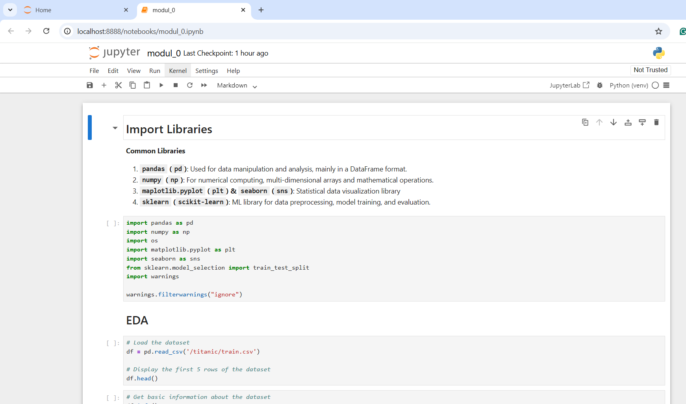
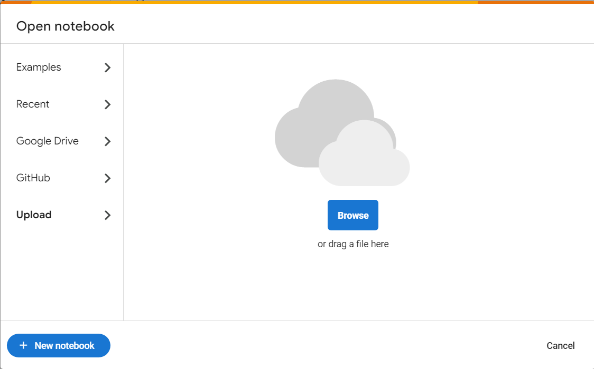
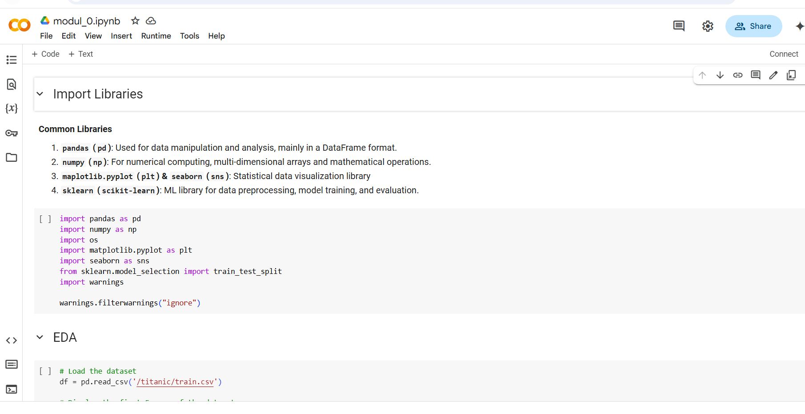
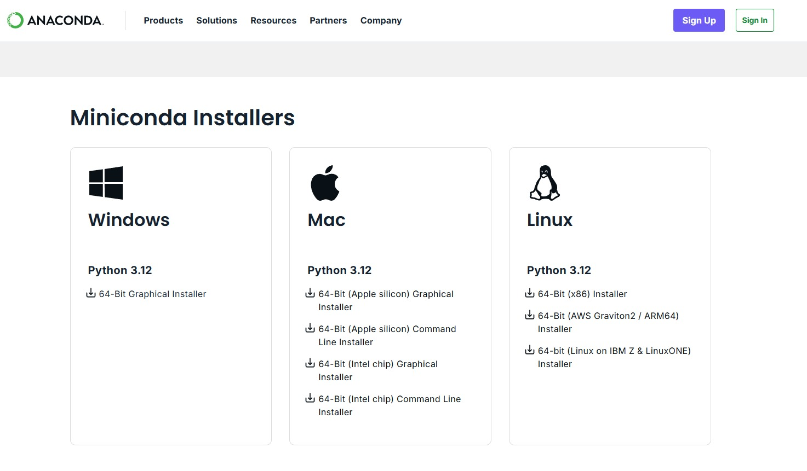
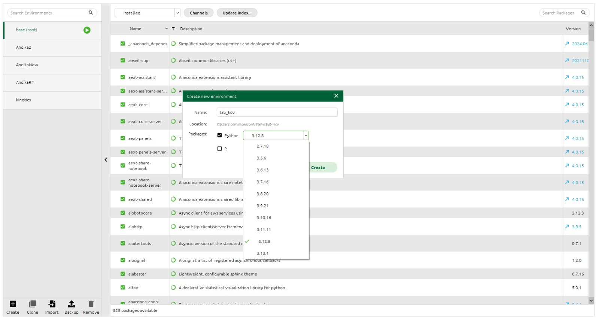

# Module 0: ML Basics

## Table of Contents
- [Module 0: ML Basics](#module-0-ml-basics)
  - [Table of Contents](#table-of-contents)
  - [Terminology](#terminology)
    - [Data](#data)
    - [Types of ML](#types-of-ml)
    - [ML Process (Basic)](#ml-process-basic)
    - [ML Process (Advanced)](#ml-process-advanced)
    - [Introduction to Deep Learning](#introduction-to-deep-learning)
  - [Tools](#tools)
  - [Coding Environment Setup](#coding-environment-setup)
    - [Local](#local)
    - [Cloud](#cloud)
    - [Anaconda / Miniconda](#anaconda--miniconda)

## Terminology

### Data
- **Machine Learning (ML)**: A subfield of AI that trains algorithms to learn from data and make predictions without explicit programming.  
- **Dataset**: A collection of data used to train or evaluate an ML model.  
- **Metadata**: Information that describes the dataset (e.g., dataset name, number of rows/columns, data source, etc.).
- **Features**: Input variables used by the model to make predictions (e.g., house size, number of rooms).  
- **Labels**: Output variables that are to be predicted (e.g., house price).  
### Types of ML
- **Supervised Learning**: ML trained using labeled data (e.g., classification, regression).  
- **Unsupervised Learning**: ML trained using unlabeled data (e.g., clustering).  
- **Classification**: Predicting discrete categories (e.g., spam or not spam).  
- **Regression**: Predicting continuous values (e.g., price prediction).  
- **Clustering**: Grouping data based on similarity.  
### ML Process (Basic)
- **Preprocessing**: The process of cleaning, transforming, and preparing data before using it to train a model.
- **Model**: A mathematical representation of the process learned from data.  
- **Training**: The process of training the model with data to learn patterns.  
- **Epoch**: One complete pass through the entire dataset during training.  
- **Validation**: The process of evaluating the model on data not used for training.
- **Testing**: The process of evaluating the model on data not used for training and validation.
- **Evaluation Metrics**: Metrics used to evaluate model performance (e.g., accuracy, precision, recall).
- **Prediction**: The model's output when given new input.
### ML Process (Advanced)
- **Feature Engineering**: The process of selecting or creating features to improve model performance.  
- **Cross-Validation**: A technique for evaluating the model by splitting the data into multiple subsets.  
- **Hyperparameters**: Model settings determined before training (non-trainable parameters).  
- **Loss Function**: A function that measures the error of the model's predictions.  
- **Gradient Descent**: An optimization algorithm to minimize the loss function.
- **Bias**: The difference between the expected (average) prediction of the model and the true value. 
- **Variance**: How much the model's predictions fluctuate for different training sets. 
- **Overfitting**: The model is too complex, performs very well on training data but poorly on test data.  
- **Underfitting**: The model is too simple, performs poorly on both training and test data.    
### Introduction to Deep Learning
- **Neural Network**: An ML model inspired by the structure of the human brain.  
- **Deep Learning**: ML using neural networks with many layers.  
- **Pre-trained Model**: A model already trained on a large dataset and can be used for other tasks.
- **Transfer Learning**: A technique of using a pre-trained model for a specific task.

## Tools

> A good developer is one who frequently reads documentation

- [NumPy](https://numpy.org/): A library for numerical computation in Python. Used for mathematical operations on arrays and matrices.
- [Pandas](https://pandas.pydata.org/): A library for data manipulation and analysis. Useful for working with data tables (DataFrame).
- [Matplotlib](https://matplotlib.org/) & [Seaborn](https://seaborn.pydata.org/): Libraries for statistical data visualization. Allow creating graphs, plots, and other visualizations.
- [Scikit-learn](https://scikit-learn.org/): A library for machine learning in Python. Provides tools for classification, regression, clustering, and more.
- [TensorFlow](https://www.tensorflow.org/): An open-source library for deep learning developed by Google. Suitable for building and training neural network models.
- [PyTorch](https://pytorch.org/): A deep learning library developed by Facebook. Popular for its flexibility and ease of use.
- [Keras](https://keras.io/): A high-level API for building and training deep learning models. Usually runs on top of TensorFlow.
- [SciPy](https://scipy.org/): A library for scientific and technical computing. Provides functions for optimization, integration, and linear algebra.
- [Statsmodels](https://www.statsmodels.org/): A library for statistical analysis. Suitable for estimating statistical models and hypothesis testing.
- [XGBoost](https://xgboost.readthedocs.io/)/[LightGBM](https://lightgbm.readthedocs.io/)/[CatBoost](https://catboost.ai/): Libraries for gradient boosting algorithms.
- [OpenCV](https://opencv.org/): A library for computer vision. Used for image and video processing.
- [NLTK (Natural Language Toolkit)](https://www.nltk.org/): A library for natural language processing (NLP). Useful for text and linguistic analysis.
- [spaCy](https://spacy.io/): A modern NLP library designed for speed and efficiency.
- [Plotly](https://plotly.com/): A library for interactive visualization. Suitable for creating dashboards and dynamic graphs.
- [Beautiful Soup](https://www.crummy.com/software/BeautifulSoup/): A library for web scraping. Helps extract data from HTML and XML.
- [Requests](https://docs.python-requests.org/): A library for sending HTTP requests. Useful for fetching data from web APIs.
- [Flask](https://flask.palletsprojects.com/)/[Django](https://www.djangoproject.com/)/[FastAPI](https://fastapi.tiangolo.com/): Frameworks for building web applications. Often used for deploying ML models. 

## Coding Environment Setup
### Local
1. Create a virtual environment (optional but recommended)

```bash
python3 -m venv venv
```

2. Activate the virtual environment

- Linux / MacOS

```bash
source venv/bin/activate
```

- Windows

```bash
venv\Scripts\activate
```

3. Upgrade Pip and Install Jupyter Notebook

```bash
pip install --upgrade pip setuptools
pip install notebook
```

4. Add the virtual environment to Jupyter (if using venv)

```bash
pip install ipykernel
python -m ipykernel install --user --name=venv --display-name "Python (venv)"
```

5. Run Jupyter Notebook

Jupyter Notebook is a web-based application for writing and running code interactively. Used in data science and machine learning, it supports various languages, allows data visualization, and documentation with Markdown.

```bash
jupyter notebook
```




Ensure the correct kernel is used (top right of the interface)

After finishing using the notebook, deactivate the virtual environment:

```bash
deactivate
```

### Cloud
**Google Colab**

1. Open and register/login to https://colab.research.google.com/

2. Click the new notebook button


or upload your own notebook



3. Run the notebook



**Other Cloud Notebooks**

- [Kaggle](https://www.kaggle.com/)
- [Binder](https://mybinder.org/)
- [Deepnote](https://deepnote.com/)

### Anaconda / Miniconda
Anaconda Environment is a virtual environment managed by Anaconda to isolate packages and dependencies in Python projects. With this, users can have different versions of Python and libraries without conflicts between projects.

1. Install [Anaconda](https://www.anaconda.com/products/distribution) or Miniconda (a lightweight version of Anaconda)



2. Open Anaconda Navigator


3. Create a New Environment


> If you want to install CUDA on your PC, please access [this link](https://medium.com/@lab.is.its/instalasi-cuda-dan-cudnn-pada-windows-11-7c562138d27d) and choose the CUDA version that matches your PC specifications.