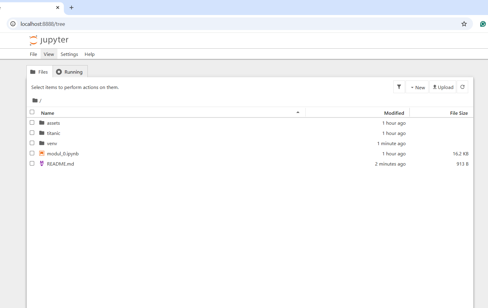
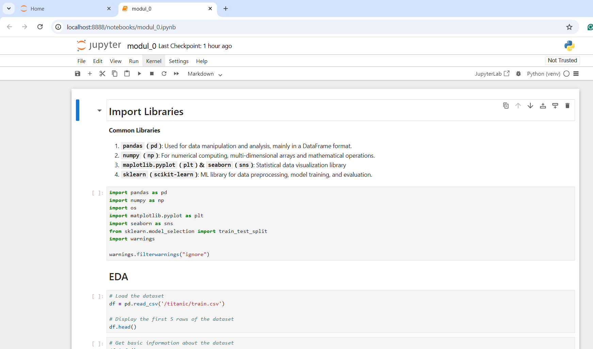
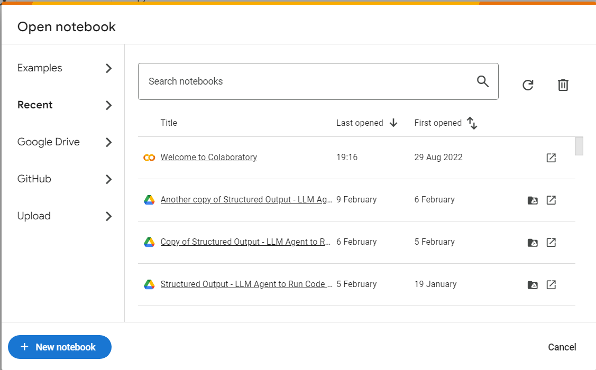
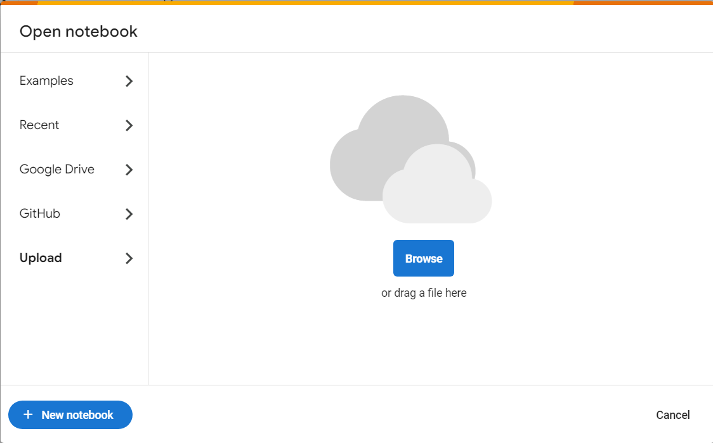
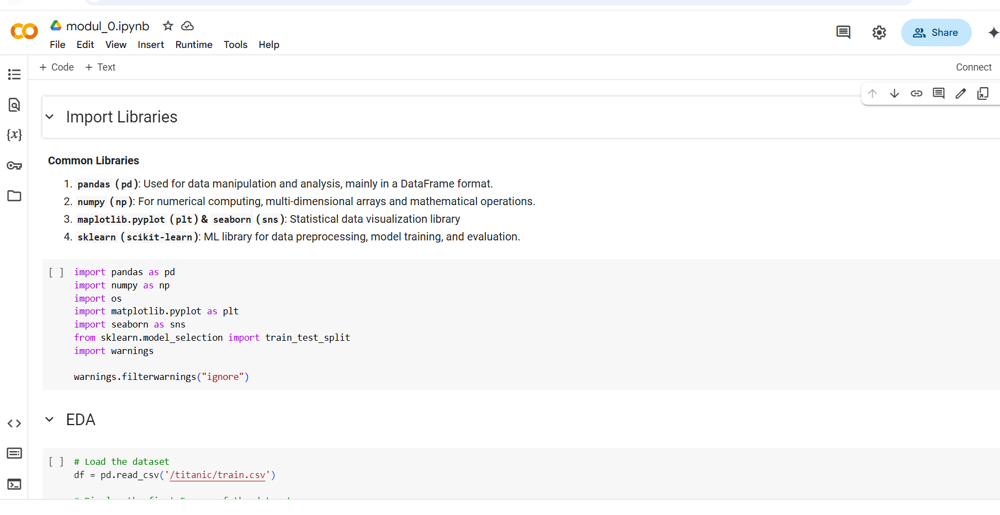

# Modul 0: ML Basics

## Daftar Isi
- [Modul 0: ML Basics](#modul-0-ml-basics)
  - [Daftar Isi](#daftar-isi)
  - [Terminology](#terminology)
  - [Tools](#tools)
  - [Coding Environtment Setup](#coding-environtment-setup)
    - [Local](#local)
    - [Cloud](#cloud)

## Terminology

- **Machine Learning (ML)**: Sub-bidang AI yang melatih algoritma untuk belajar dari data dan membuat prediksi tanpa pemrograman eksplisit.  
- **Dataset**: Kumpulan data yang digunakan untuk melatih atau mengevaluasi model ML.  
- **Features**: Variabel input yang digunakan model untuk membuat prediksi (misal: luas rumah, jumlah kamar).  
- **Labels**: Variabel output yang ingin diprediksi (misal: harga rumah).  
- **Training**: Proses melatih model dengan data untuk mempelajari pola.  
- **Model**: Representasi matematis dari proses yang dipelajari dari data.  
- **Supervised Learning**: ML yang dilatih menggunakan data berlabel (contoh: klasifikasi, regresi).  
- **Unsupervised Learning**: ML denyang dilatih menggunakan data tanpa label (contoh: clustering).  
- **Classification**: Prediksi kategori diskrit (misal: spam atau bukan spam).  
- **Regression**: Prediksi nilai kontinu (misal: prediksi harga).  
- **Clustering**: Pengelompokan data berdasarkan kemiripan.  
- **Overfitting**: Model terlalu kompleks, performa sangat baik pada data latih tetapi buruk pada data uji.  
- **Underfitting**: Model terlalu sederhana, performa buruk pada data latih dan uji.  
- **Test Data**: Data terpisah untuk mengevaluasi performa model.  
- **Accuracy**: Seberapa sering prediksi model benar (untuk klasifikasi).  
- **Loss Function**: Fungsi yang mengukur kesalahan prediksi model.  
- **Epoch**: Satu kali proses pelatihan melalui seluruh dataset.  
- **Bias**: Perbedaan antara prediksi yang diharapkan (rata-rata) dari model dan nilai sebenarnya. 
- **Variance**: Seberapa besar prediksi model berfluktuasi untuk set data pelatihan yang berbeda. 
- **Hyperparameters**: Pengaturan model yang ditentukan sebelum pelatihan (non-trainable parameters).  
- **Cross-Validation**: Teknik evaluasi model dengan membagi data menjadi beberapa subset.  
- **Feature Engineering**: Proses memilih atau membuat fitur untuk meningkatkan performa model.  
- **Neural Network**: Model ML yang terinspirasi dari struktur otak manusia.  
- **Deep Learning**: ML menggunakan neural network dengan banyak lapisan.  
- **Gradient Descent**: Algoritma optimasi untuk meminimalkan loss function.

## Tools

- **NumPy**: Library untuk komputasi numerik di Python. Digunakan untuk operasi matematika pada array dan matriks.  
- **Pandas**: Library untuk manipulasi dan analisis data. Berguna untuk bekerja dengan tabel data (DataFrame).  
- **Matplotlib & Seaborn**: Library untuk visualisasi statistik data. Memungkinkan pembuatan grafik, plot, dan visualisasi lainnya.  
- **Scikit-learn**: Library untuk machine learning di Python. Menyediakan alat untuk klasifikasi, regresi, clustering, dan lainnya.  
- **TensorFlow**: Library open-source untuk deep learning yang dikembangkan oleh Google. Cocok untuk membangun dan melatih model neural network.  
- **PyTorch**: Library deep learning yang dikembangkan oleh Facebook. Populer karena fleksibilitas dan kemudahan penggunaannya.  
- **Keras**: API high-level untuk membangun dan melatih model deep learning. Biasanya berjalan di atas TensorFlow.  
- **SciPy**: Library untuk komputasi saintifik dan teknis. Menyediakan fungsi untuk optimasi, integrasi, dan aljabar linear.  
- **Statsmodels**: Library untuk analisis statistik. Cocok untuk estimasi model statistik dan uji hipotesis.  
- **XGBoost/LightGBM/CatBoost**: Library untuk algoritma gradient boosting.
- **OpenCV**: Library untuk computer vision. Digunakan untuk pemrosesan gambar dan video.  
- **NLTK (Natural Language Toolkit)**: Library untuk pemrosesan bahasa alami (NLP). Berguna untuk analisis teks dan linguistik.  
- **spaCy**: Library NLP modern yang dirancang untuk kecepatan dan efisiensi. 
- **Plotly**: Library untuk visualisasi interaktif. Cocok untuk membuat dashboard dan grafik dinamis.  
- **Beautiful Soup**: Library untuk web scraping. Membantu mengekstrak data dari HTML dan XML.  
- **Requests**: Library untuk mengirim HTTP requests. Berguna untuk mengambil data dari web API.  
- **Flask/Django/Fastapi**: Framework untuk membangun aplikasi web. Sering digunakan untuk deployment model ML.  

## Coding Environtment Setup
### Local
1. Buat virtual environtment (opsional tetapi disarankan)

```bash
python3 -m venv venv
```

2. Aktifkan virtual environtment

- Linux / MacOS

```bash
source venv/bin/activate
```

- Windows

```bash
venv\Scripts\activate
```

3. Upgrade Pip dan Install jupyter notebook

```bash
pip install --upgrade pip setuptools
pip install notebook
```

4. Tambahkan virtual environtment ke jupyter (jika menggunakan venv)

```bash
pip install ipykernel
python -m ipykernel install --user --name=venv --display-name "Python (venv)"
```

5. Jalankan jupyter notebook

```bash
jupyter notebook
```





Pastikan kernel yang digunakan sesuai (kanan atas tampilan)

Setelah selesai menggunakan notebook, nonaktifkan virtual environtment:

```bash
deactivate
```

### Cloud
**Google Colab**

1. Buka dan register/login ke https://colab.research.google.com/

2. Klik tombol new notebook



atau upload notebook sendiri



3. Jalankan notebook



**Cloud Notebook Lain**

- [Kaggle](https://www.kaggle.com/)
- [Binder](https://mybinder.org/)
- [Deepnote](https://deepnote.com/)
