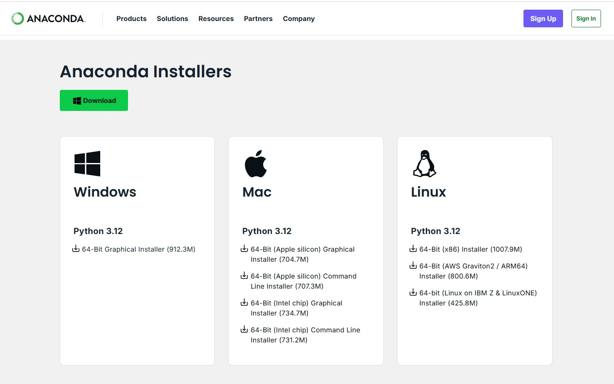
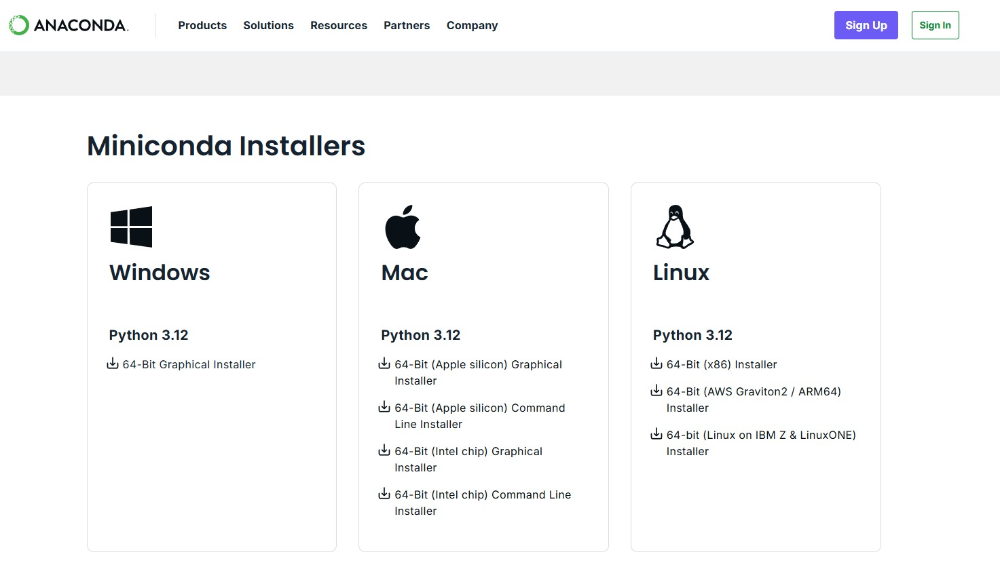
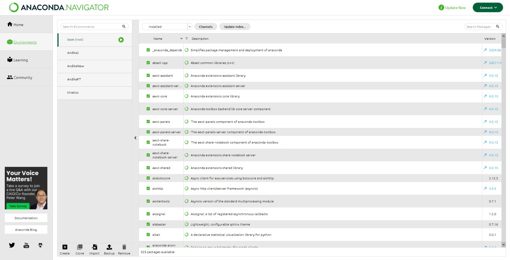
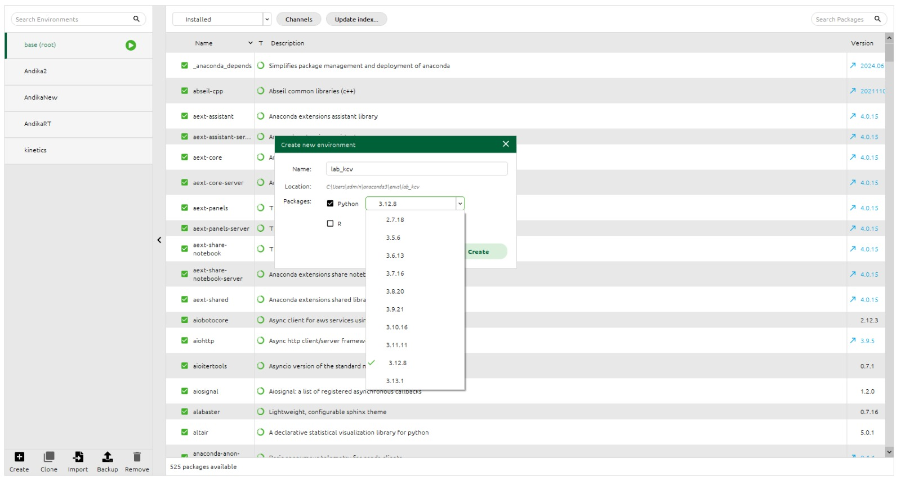

# Modul 0: ML Basics

## Daftar Isi
- [Modul 0: ML Basics](#modul-0-ml-basics)
  - [Daftar Isi](#daftar-isi)
  - [Terminology](#terminology)
    - [Data](#data)
    - [Jenis-jenis ML](#jenis-jenis-ml)
    - [Proses ML (Basic)](#proses-ml-basic)
    - [Proses ML (Advanced)](#proses-ml-advanced)
    - [Pengantar Deep Learning](#pengantar-deep-learning)
  - [Tools](#tools)
  - [Coding Environtment Setup](#coding-environtment-setup)
    - [Local](#local)
    - [Cloud](#cloud)
    - [Anaconda / Miniconda](#anaconda--miniconda)

## Terminology

### Data
- **Machine Learning (ML)**: Sub-bidang AI yang melatih algoritma untuk belajar dari data dan membuat prediksi tanpa pemrograman eksplisit.  
- **Dataset**: Kumpulan data yang digunakan untuk melatih atau mengevaluasi model ML.  
- **Metadata**: Informasi yang menjelaskan tentang dataset (misal: nama dataset, jumlah baris/kolom, sumber data, dll).
- **Features**: Variabel input yang digunakan model untuk membuat prediksi (misal: luas rumah, jumlah kamar).  
- **Labels**: Variabel output yang ingin diprediksi (misal: harga rumah).  
### Jenis-jenis ML
- **Supervised Learning**: ML yang dilatih menggunakan data berlabel (contoh: klasifikasi, regresi).  
- **Unsupervised Learning**: ML denyang dilatih menggunakan data tanpa label (contoh: clustering).  
- **Classification**: Prediksi kategori diskrit (misal: spam atau bukan spam).  
- **Regression**: Prediksi nilai kontinu (misal: prediksi harga).  
- **Clustering**: Pengelompokan data berdasarkan kemiripan.  
### Proses ML (Basic)
- **Preprocessing**: Proses membersihkan, mengubah, dan menyiapkan data sebelum digunakan untuk pelatihan model.
- **Model**: Representasi matematis dari proses yang dipelajari dari data.  
- **Training**: Proses melatih model dengan data untuk mempelajari pola.  
- **Epoch**: Satu kali proses pelatihan melalui seluruh dataset.  
- **Validation**: Proses mengevaluasi model pada data yang tidak digunakan untuk pelatihan.
- **Testing**: Proses mengevaluasi model pada data yang tidak digunakan untuk pelatihan dan validasi.
- **Evaluation Metrics**: Metrik yang digunakan untuk mengevaluasi performa model (misal: accuracy, precision, recall).
- **Prediction**: Output model ketika diberikan input baru.
### Proses ML (Advanced)
- **Feature Engineering**: Proses memilih atau membuat fitur untuk meningkatkan performa model.  
- **Cross-Validation**: Teknik evaluasi model dengan membagi data menjadi beberapa subset.  
- **Hyperparameters**: Pengaturan model yang ditentukan sebelum pelatihan (non-trainable parameters).  
- **Loss Function**: Fungsi yang mengukur kesalahan prediksi model.  
- **Gradient Descent**: Algoritma optimasi untuk meminimalkan loss function.
- **Bias**: Perbedaan antara prediksi yang diharapkan (rata-rata) dari model dan nilai sebenarnya. 
- **Variance**: Seberapa besar prediksi model berfluktuasi untuk set data pelatihan yang berbeda. 
- **Overfitting**: Model terlalu kompleks, performa sangat baik pada data latih tetapi buruk pada data uji.  
- **Underfitting**: Model terlalu sederhana, performa buruk pada data latih dan uji.    
### Pengantar Deep Learning
- **Neural Network**: Model ML yang terinspirasi dari struktur otak manusia.  
- **Deep Learning**: ML menggunakan neural network dengan banyak lapisan.  
- **Pre-trained Model**: Model yang sudah dilatih pada dataset besar dan dapat digunakan untuk tugas lain.
- **Transfer Learning**: Teknik menggunakan pre-trained model untuk tugas spesifik.

## Tools

> Developer yang baik adalah developer yang sering membaca dokumentasi

- [NumPy](https://numpy.org/): Library untuk komputasi numerik di Python. Digunakan untuk operasi matematika pada array dan matriks.
- [Pandas](https://pandas.pydata.org/): Library untuk manipulasi dan analisis data. Berguna untuk bekerja dengan tabel data (DataFrame).
- [Matplotlib](https://matplotlib.org/) & [Seaborn](https://seaborn.pydata.org/): Library untuk visualisasi statistik data. Memungkinkan pembuatan grafik, plot, dan visualisasi lainnya.
- [Scikit-learn](https://scikit-learn.org/): Library untuk machine learning di Python. Menyediakan alat untuk klasifikasi, regresi, clustering, dan lainnya.
- [TensorFlow](https://www.tensorflow.org/): Library open-source untuk deep learning yang dikembangkan oleh Google. Cocok untuk membangun dan melatih model neural network.
- [PyTorch](https://pytorch.org/): Library deep learning yang dikembangkan oleh Facebook. Populer karena fleksibilitas dan kemudahan penggunaannya.
- [Keras](https://keras.io/): API high-level untuk membangun dan melatih model deep learning. Biasanya berjalan di atas TensorFlow.
- [SciPy](https://scipy.org/): Library untuk komputasi saintifik dan teknis. Menyediakan fungsi untuk optimasi, integrasi, dan aljabar linear.
- [Statsmodels](https://www.statsmodels.org/): Library untuk analisis statistik. Cocok untuk estimasi model statistik dan uji hipotesis.
- [XGBoost](https://xgboost.readthedocs.io/)/[LightGBM](https://lightgbm.readthedocs.io/)/[CatBoost](https://catboost.ai/): Library untuk algoritma gradient boosting.
- [OpenCV](https://opencv.org/): Library untuk computer vision. Digunakan untuk pemrosesan gambar dan video.
- [NLTK (Natural Language Toolkit)](https://www.nltk.org/): Library untuk pemrosesan bahasa alami (NLP). Berguna untuk analisis teks dan linguistik.
- [spaCy](https://spacy.io/): Library NLP modern yang dirancang untuk kecepatan dan efisiensi.
- [Plotly](https://plotly.com/): Library untuk visualisasi interaktif. Cocok untuk membuat dashboard dan grafik dinamis.
- [Beautiful Soup](https://www.crummy.com/software/BeautifulSoup/): Library untuk web scraping. Membantu mengekstrak data dari HTML dan XML.
- [Requests](https://docs.python-requests.org/): Library untuk mengirim HTTP requests. Berguna untuk mengambil data dari web API.
- [Flask](https://flask.palletsprojects.com/)/[Django](https://www.djangoproject.com/)/[FastAPI](https://fastapi.tiangolo.com/): Framework untuk membangun aplikasi web. Sering digunakan untuk deployment model ML. 

## Coding Environtment Setup
### Local
1. Buat virtual environtment (opsional tetapi disarankan)

```bash
python3 -m venv venv
```

2. Aktifkan virtual environtment

- Linux / MacOS

```bash
source venv/bin/activate
```

- Windows

```bash
venv\Scripts\activate
```

3. Upgrade Pip dan Install jupyter notebook

```bash
pip install --upgrade pip setuptools
pip install notebook
```

4. Tambahkan virtual environtment ke jupyter (jika menggunakan venv)

```bash
pip install ipykernel
python -m ipykernel install --user --name=venv --display-name "Python (venv)"
```

5. Jalankan Jupyter Notebook

Jupyter Notebook adalah aplikasi berbasis web untuk menulis dan menjalankan kode secara interaktif. Digunakan dalam data science dan machine learning, mendukung berbagai bahasa, memungkinkan visualisasi data, serta dokumentasi dengan Markdown.

```bash
jupyter notebook
```


Pastikan kernel yang digunakan sesuai (kanan atas tampilan)

Setelah selesai menggunakan notebook, nonaktifkan virtual environtment:

```bash
deactivate
```

### Cloud
**Google Colab**

1. Buka dan register/login ke https://colab.research.google.com/

2. Klik tombol new notebook


atau upload notebook sendiri


3. Jalankan notebook


**Cloud Notebook Lain**

- [Kaggle](https://www.kaggle.com/)
- [Binder](https://mybinder.org/)
- [Deepnote](https://deepnote.com/)

### Anaconda / Miniconda
Anaconda Environment adalah lingkungan virtual yang dikelola oleh Anaconda untuk mengisolasi paket dan dependensi dalam proyek Python. Dengan ini, pengguna bisa memiliki berbagai versi Python dan pustaka tanpa konflik antar proyek.

1. Install [Anaconda](https://www.anaconda.com/products/distribution) atau Miniconda (versi ringan Anaconda)



2. Buka Anaconda Navigator


3. Buat Environment Baru


> Jika Anda ingin sekaligus install CUDA pada PC Anda, silakan akses [link ini](https://medium.com/@lab.is.its/instalasi-cuda-dan-cudnn-pada-windows-11-7c562138d27d) dan pilih versi CUDA yang sesuai dengan spesifikasi PC Anda.