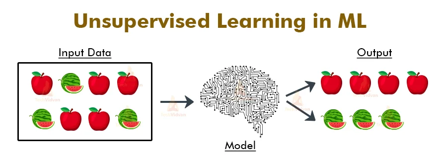
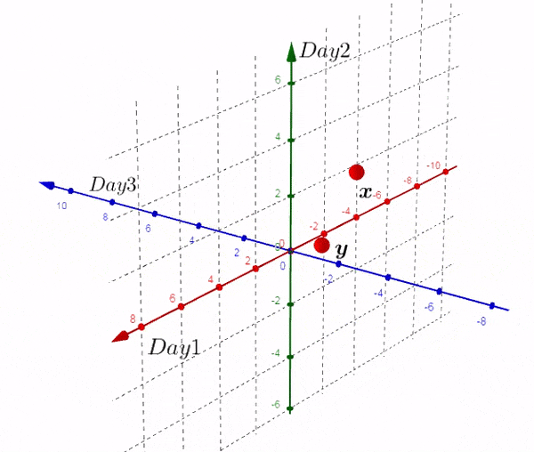
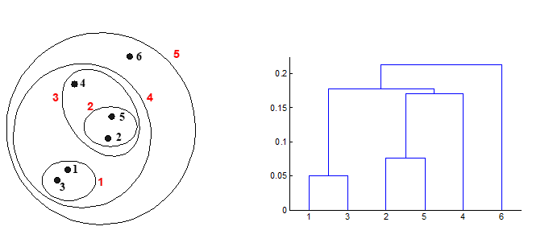

# Module 1: Unsupervised Learning

## Table of Contents

- [Definition](#definition)
- [What are the types of unsupervised learning](#what-are-the-types-of-unsupervised-learning)
- [Clustering](#clustering-1)
  - [Prerequisite](#prerequisite)
  - [K-Means Clustering](#k-means-clustering)
  - [Hierarchical Clustering](#hierarchical-clustering)
  - [DBSCAN](#dbscan)
- [Principal Component Analysis](#principal-component-analysis)

## Definition

Machine learning models that are trained on data **without** using labels.

What the model does is **learn patterns from the data**

### What are the types of unsupervised learning

**Clustering**

**Dimensionality Reduction**

## CLUSTERING

Clustering is the process of grouping data (objects) into groups called **clusters**. Clusters are grouped based on the similarity between objects.

\*\*The similarity is measured by the distance between the data.

The main objectives of cluster analysis are:

- Minimize Intra Cluster
- Maximize Inter-Cluster

### PREREQUISITE!!!

Now because we will look for similarities between data by distance, we must know how to calculate the distance. There are several distance formulas that can be used:

1. Manhattan Distance
2. Euclidean Distance
3. Minkowski Distance

### K-Means Clustering

K-Means clustering is an algorithm that groups **N data** (based on features/attributes) into **K clusters**. A cluster in K-Means is centered on a **centroid point**. Besides K-Means, there are also K-Medians and [K-Medoids](https://esairina.medium.com/clustering-menggunakan-algoritma-k-medoids-67179a333723).

**How does K-Means work?**

### Hierarchical Clustering

**Definition** = An algorithm that generates clusters by organizing them like a hierarchical tree.

**Types of Hierarchical Clustering**:

1. Agglomerative (Bottom-Up)
2. Divisive (Top-Down)

### DBSCAN

**Definition** = Density-Based Spatial Clustering of Applications with Noise (DBSCAN) is a basic algorithm for density-based clustering. DBSCAN can also be used to _handle_ outliers.

## Principal Component Analysis

**Definition** = A statistical technique used to **reduce the dimensionality of data** by transforming the original variables into a new set of variables
