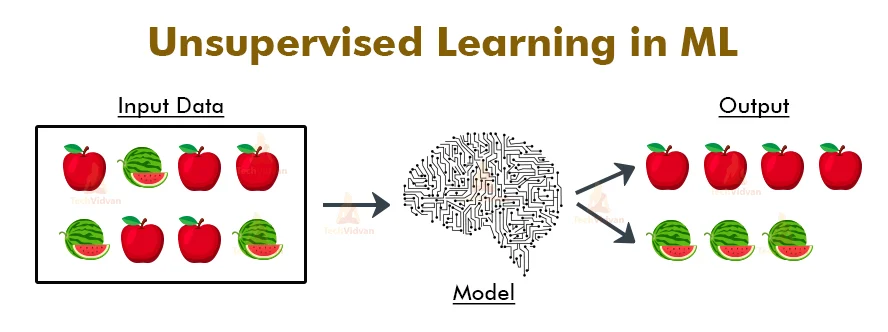
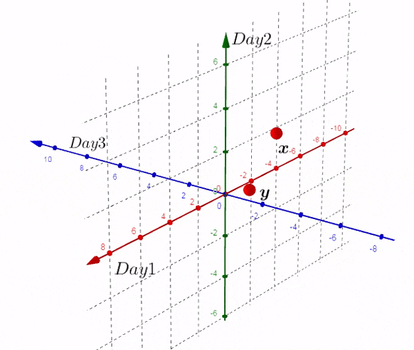
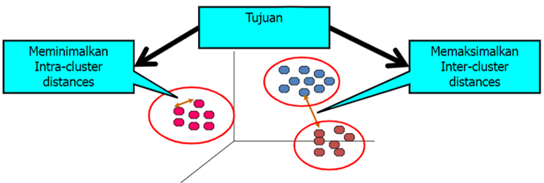
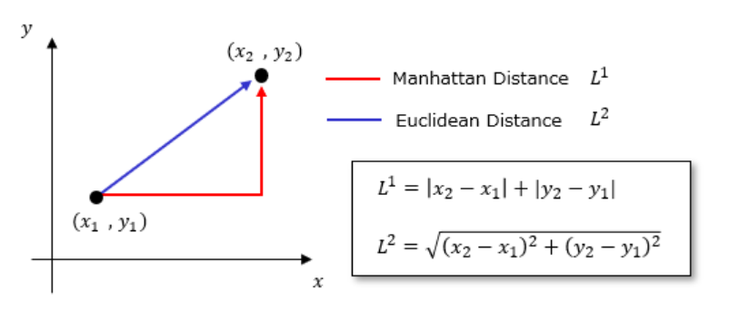
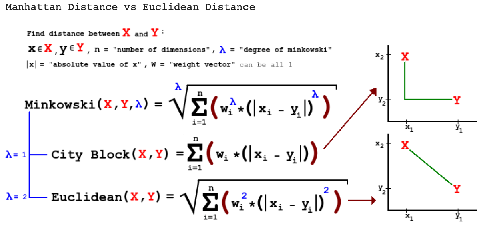
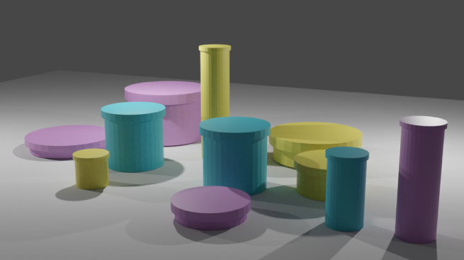
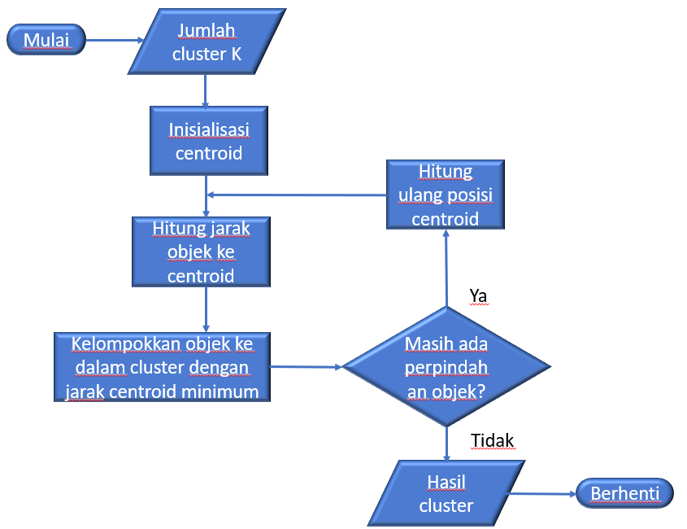
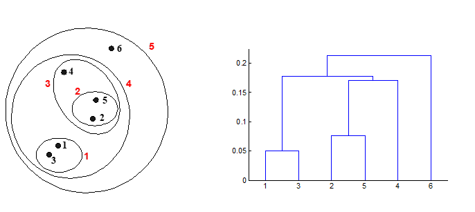

# Modul 1: Unsupervised Learning

## Daftar Isi
- [Definisi](#definisi)
- [Apa saja tipe unsupervised learning](#apa-saja-tipe-unsupervised-learning)
- [Clustering](#clustering-1)
    - [Prasyarat](#prasyarat)
    - [K-Means Clustering](#k-means-clustering)
    - [Hierarchical Clustering](#hierarchical-clustering)
    - [DBSCAN](#dbscan)
- [Principal Component Analysis](#principal-component-analysis)

## Definisi
Model machine learning yang dilatih dengan data **tanpa** menggunakan label.

Yang dilakukan model adalah **mempelajari pola dari data**

### Apa saja tipe unsupervised learning

**Clustering**

**Dimensionality Reduction**

## CLUSTERING

Clustering adalah proses mengelompokkan data (objek) ke dalam kelompok-kelompok yang disebut **cluster**. Cluster dikelompokkan berdasarkan **kemiripan** antar objek.

**Kemiripan diukur dari jarak antar data**

Tujuan utama analisis cluster adalah:
- Meminimalkan Intra Cluster
- Memaksimalkan Inter-Cluster

### PRASYARAT!!!

Nah karena kita akan mencari kemiripan antar data dengan jaraknya, kita harus mengetahui cara untuk menghitung jaraknya. Ada beberapa rumus jarak yang bisa dipakai:

1. Manhattan Distance
2. Euclidean Distance
3. Minkowski Distance

### K-Means Clustering

K-Means clustering adalah algoritma yang mengelompokkan **N data** (berdasarkan fitur / atribut) ke dalam **K cluster**. Sebuah cluster di K-Means berpusat pada sebuah **titik centroid**. Selain K-Means, ada juga K-Medians dan [K-Medoids](https://esairina.medium.com/clustering-menggunakan-algoritma-k-medoids-67179a333723).

**Bagaimana K-Means Bekerja???**

### Hierarchical Clustering

**Definisi** = Algoritma yang menghasilkan cluster dengan cara menyusunnya seperti pohon hirarki

**Jenis Hierarchical Clustering**:
1. Agglomerative (Bottom-Up)
2. Divisive (Top-Down)

### DBSCAN

**Definisi** = Density-Based Spatial Clustering of Applications with Noise (DBSCAN) adalah algoritma dasar untuk pengelompokan berbasis density. DBSCAN juga bisa digunakan untuk meng-*handle* outlier.

## Principal Component Analysis

**Definisi** = Teknik statistik yang digunakan untuk **mereduksi dimensi data** dengan mengubah variabel asli menjadi sekumpulan variabel baru