# Module 2: Supervised Learning - Classification

## Table of Contents

- [Module 2: Supervised Learning - Classification](#modul-2-supervised-learning---classification)
  - [Table of Contents](#list-of-contents)
  - [Introduction](#introduction)
  - [Algorithm](#algorithm)
    - [K-Nearest Neighbor (KNN)](#k-nearest-neighbor-knn)
    - [Naive Bayes (NB)](#naive-bayes-nb)
    - [Decision Tree (DT)](#decision-tree-dt)
    - [Random Forest (RF)](#random-forest-rf)
    - [Support Vector Machine (SVM)](#support-vector-machine-svm)
      - [The Kernel Trick](#the-kernel-trick)
  - [Machine Learning Techniques (Bonus)](#machine-learning-techniques-bonus)
    - [Cross-Validation (CV)](#cross-validation-cv)
      - [K-Fold](#k-fold)
      - [Stratified K-Fold](#stratified-k-fold)
    - [Hyperparameter Tuning](#hyperparameter-tuning)

## Introduction

Supervised learning is a paradigm in machine learning that uses labeled data to train mathematical algorithms. The goal is for the algorithm to learn the relationship between inputs (features) and outputs (targets) so that it can accurately predict outputs for unseen input data.

Classification is a subset of supervised learning, where the task is to group or categorize data into defined classes.

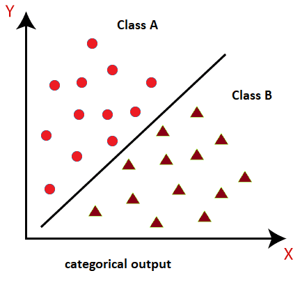

## Algorithm

### K-Nearest Neighbor (KNN)

One way to classify is to look at the majority (most) classes that surround the data we want to predict, which is basically the concept of KNN.

KNN takes as many as K (hyperparameter) nearest neighbors, then determines the class label for the new data by majority voting.

For two points $X = (x_1, x_2, ..., x_n)$ and $Y = (y_1, y_2, ..., y_n)$, the distance $d(X, Y)$ can be defined as:

**Euclidean Distance**

$$d(X, Y) = \sqrt{\sum_{i=1}^n(x_i-y_i)^2}$$

**Manhattan Distance**

$$d(X, Y) = \sum_{i=1}^n |x_i-y_i|$$

**Minkowski Distance** (generalization of euclidean and manhattan)

$$d(X, Y) = (\sum_{i=1}^n |x_i-y_i|^p)^\frac{1}{p}$$

where `p=1` manhattan, `p=2` euclidean.

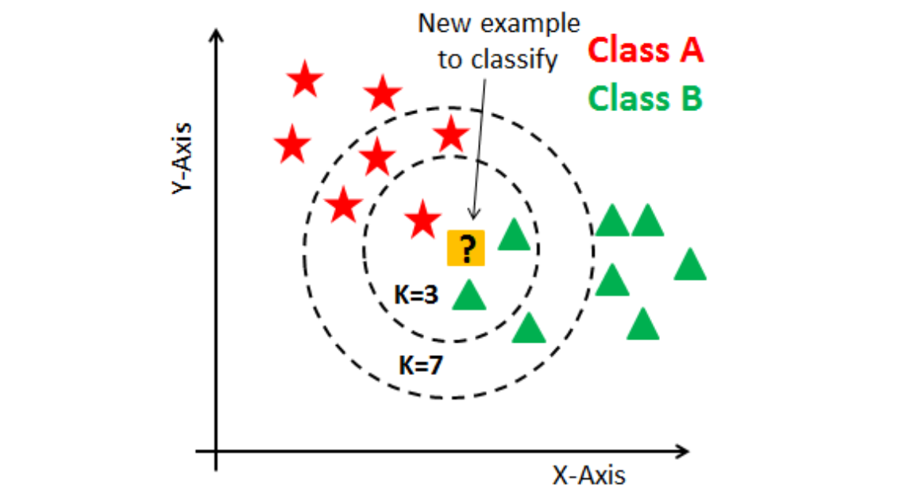

In the example above:

- **If K = 3**, neighbors with class A = 1 and class B = 2. So the data is categorized as class B.
- **If K = 7**, neighbors with class A = 4 and class B = 3. So the data is categorized as class A.

**Example Implementation:**

```python
from sklearn.neighbors import KNeighborsClassifier

X = [
    [0.1, 2.3],
    [-1.5, 2.5],
    [2.0, -4.3],
    # ...
]

y = [0, 1, 1, ] # ...

clf = KNeighborsClassifier(n_neighbors=3)
clf.fit(X, y)
```

KNN is easy to implement and is good enough for data with clear class boundaries. However, since KNN calculates the distance across all data relative to the input data, it is very slow for large or high-dimensional datasets. For Naive KNN, the time complexity is `O(ND)` where `N` is the number of data and `D` is the number of dimensions.

Another disadvantage of KNN is that, because the data takes the most votes, it is very likely that the votes are biased / dominated by classes with more data, especially in imbalanced datasets.

### Naive Bayes (NB)

Unlike KNN which relies on neighboring data, NB calculates the conditional probability of the class directly. This means that NB is not biased towards the majority class like KNN.

The probability of class $C$ given $X = (x_1, x_2, ..., x_n)$ is:

$$P(C|X) = \frac{P(X|C) \times P(C)}{P(X)}$$

NB assumes all features are conditionally independent given their class, which simplifies the probability $P(X|C)$ to the product of the individual probabilities of the features:

$$P(X|C) = P(x_1|C)\times P(x_2|C)\times ... \times P(x_n|C)$$

So the formula becomes:

$$P(C|X) = \frac{P(C)\times P(x_1|C)\times P(x_2|C)\times ... \times P(x_n|C)}{P(X)}$$

To classify the new data, calculate $P(C|X)$ for each class $C$ and assign the class with the highest probability:

$$Class = argmax_c \space P(C|X)$$

Since NB uses prior probability and feature likelihood, the class imbalance can be explained naturally, without skewing to the majority class in the dataset.

**Example Implementation:**

```python
from sklearn.naive_bayes import GaussianNB

X = [
    [0.1, 2.3],
    [-1.5, 2.5],
    [2.0, -4.3],
    # ...
]

y = [0, 1, 1, ] # ...

clf = GaussianNB()
clf.fit(X, Y)
```

This assumption of feature independence makes computationally efficient, but may not perform well if the features are highly correlated like most real-world data.

### Decision Tree (DT)

In scenarios where feature dependencies exist and interpretability is critical, a more effective approach is to route data points through various decision points until reaching a terminal state.

In DT, this hierarchical structure is used to make predictions by systematically dividing data into subsets based on specific feature values. This structure resembles a tree, where each node represents a decision based on a feature, and the leaf, or endpoint, shows the prediction result.

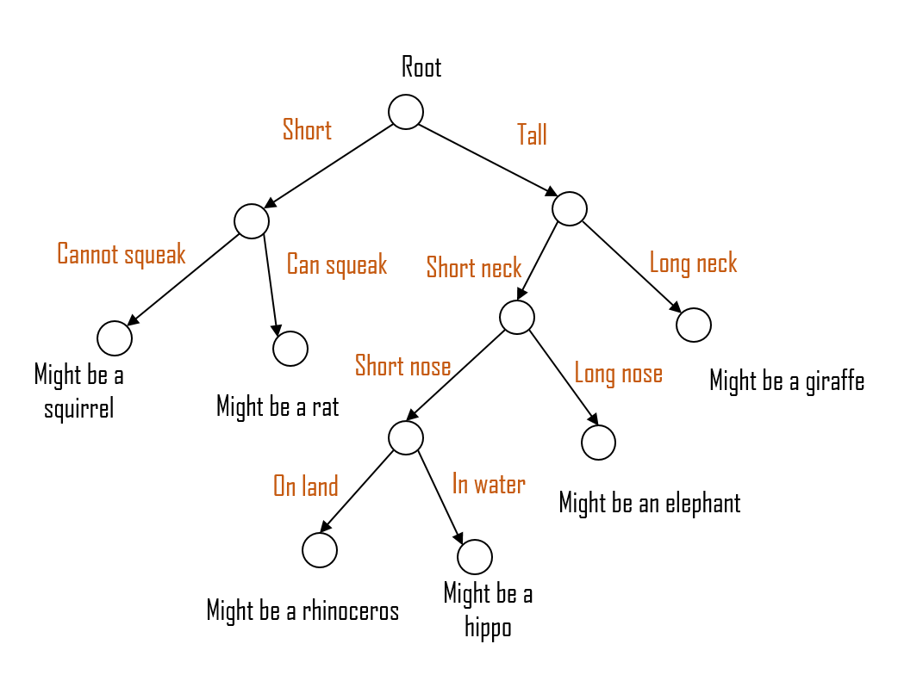

DT follows a set of rules to divide data based on feature values. DT construction involves selecting the best feature at each node to divide the data into classes or predict target variables. To measure how “good” the features selected as nodes are, entropy-based Information Gain is often used.

Entropy $(H)$ measures the impurity of a dataset:

$$H(S) = -\sum_{i=1}^c p_i \times \log_2(p_i)$$

Where:

- $S$ = dataset
- $c$ = number of classes
- $p_i$ = proportion of samples in class $i$

and a measure of entropy reduction after the dataset is split by attribute $A$ or Information Gain $(IG)$:

$$IG(S, A) = H(S) - [\sum_{i=1}^k \frac{|S_v|}{|S|} \times H(S_v)]$$

Where:

- $S$ = dataset
- $A$ = attribute used for split
- $S_v$ = subset of $S$ where attribute $A$ has value $v$
- $|S_v|$ = number of samples in subset $S_v$
- $|S||$ = total samples in dataset $S$

An alternative to entropy used for classification is Gini Impurity $(Gini)$:

$$Gini(S) = 1 - \sum_{i=1}^c p_i^2$$

At each node, DT selects the appropriate features and thresholds that maximize Information Gain or minimize Gini impurity. This process continues recursively until the stopping criteria (e.g., max depth, min samples per leaf) are met.

**Example Implementation:**

```python
from sklearn.tree import DecisionTreeClassifier

X = [
    [0.1, 2.3],
    [-1.5, 2.5],
    [2.0, -4.3],
    # ...
]

y = [0, 1, 1, ] # ...

clf = DecisionTreeClassifier()
clf = clf.fit(X, Y)
```

### Random Forest (RF)

DT is easy to build, use, and interpret but not very good in practice. Quoting from the book “The Elements of Statistical Learning”,

> Trees have one aspect that prevents them from being an ideal tool for predictive learning, namely inaccuracy. They seldom provide predictive accuracy comparable to the best that can be achieved with the data at hand.

In other words, tree models work well with the data used for training, but are not flexible when classifying new samples (overfitting). One way to overcome this is to combine several models, commonly called ensemble methods, to reduce model variance.

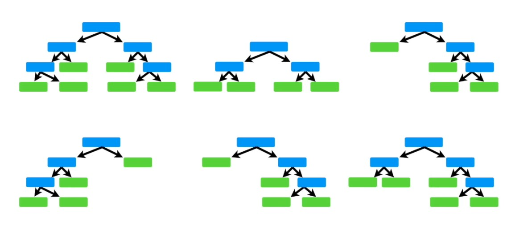

RF constructs many DTs at training time. Each tree is constructed by randomly sampling data from the original dataset (bootstrap data). For each split in the node, RF only considers a random subset of features (not all features) from the dataset.

All trees built with the sampled data and the random subset of features will each be trained. After all the trees are trained, the prediction results from each tree are aggregated to determine the final prediction, the process of bootstrapping data and aggregation to make predictions is called bagging (bootstrap bagging).

One thing to note, the training process produces out-of-bag (OOB) data for each tree. OOB data is data that is not used to train the tree.

Each tree in the forest predicts a class from its OOB data, and its accuracy is calculated. The average accuracy of all trees, known as the OOB error, gives an idea of the overall performance of the model.

For an RF consisting of $T$ trees, the OOB error (for classification) can be calculated as:

$$OOB\space Error = \frac{1}{N}\sum_{i=1}^N I(y_{i,OOB}\not={y_i})$$

Where:

- $N$ = total number of samples in the dataset
- $I(condition)$ = Indicator Function, 1 if the predicted label $y_{i,OOB}$ is not equal to the true label ${y_i}$ and 0 otherwise
- $y_{i,OOB}$ = majority vote of out-of-bag predictions for sample $i$
- ${y_i}$ = true label of sample $i$

If the OOB error is high, the model can be changed by increasing the number of trees, adjusting the depth of the tree, or changing the number of features used for split nodes, until the OOB error decreases. By utilizing the OOB error, Random Forest automatically adjusts itself during training to achieve good accuracy and generalization without requiring additional validation data.

**Example Implementation:**

```python
from sklearn.ensemble import RandomForestClassifier

X = [
    [0.1, 2.3],
    [-1.5, 2.5],
    [2.0, -4.3],
    # ...
]

y = [0, 1, 1, ] # ...

clf = RandomForestClassifier(random_state=42)
clf.fit(X, y)
```

### Support Vector Machine (SVM)

SVM deviates from the tree approach in that like KNN, the object to be classified is represented as a point in n-dimensional space where each axis indicates a feature. SVM classifies by creating a hyperplane, or decision boundary, with an n-1 dimensional plane (e.g. a line hyperplane for 2 dimensions and a board hyperplane for 3 dimensions) such that all points of a class are on one side, and the other classes are on the other side.

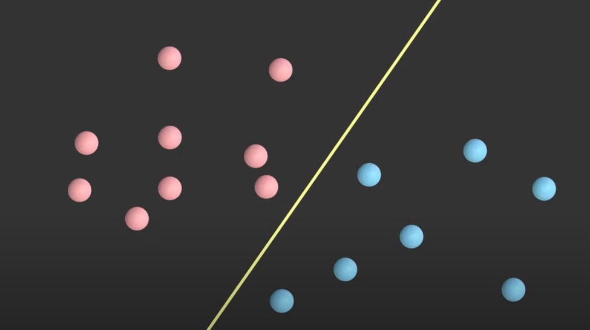

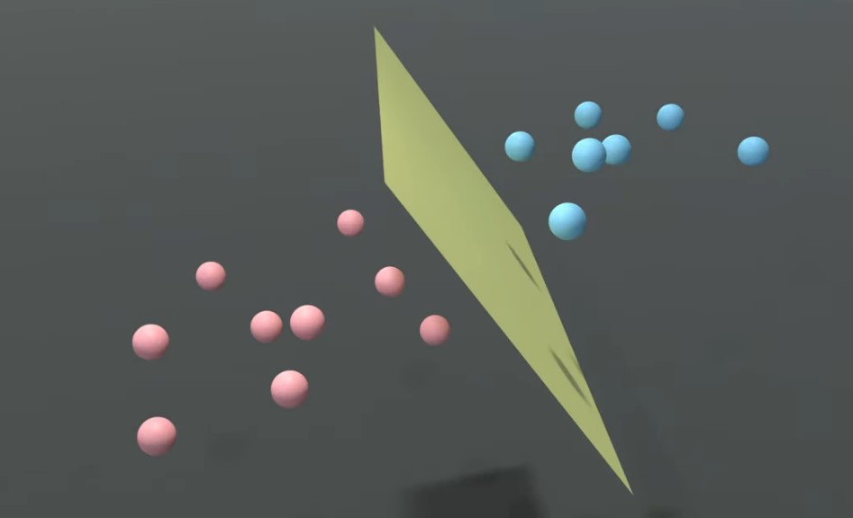

The SVM tries to find the single best hyperplane that separates the two classes in the sense that it maximizes the distance to points in the two classes. This distance is called the margin $w$ and the point inside the margin is the support vector.

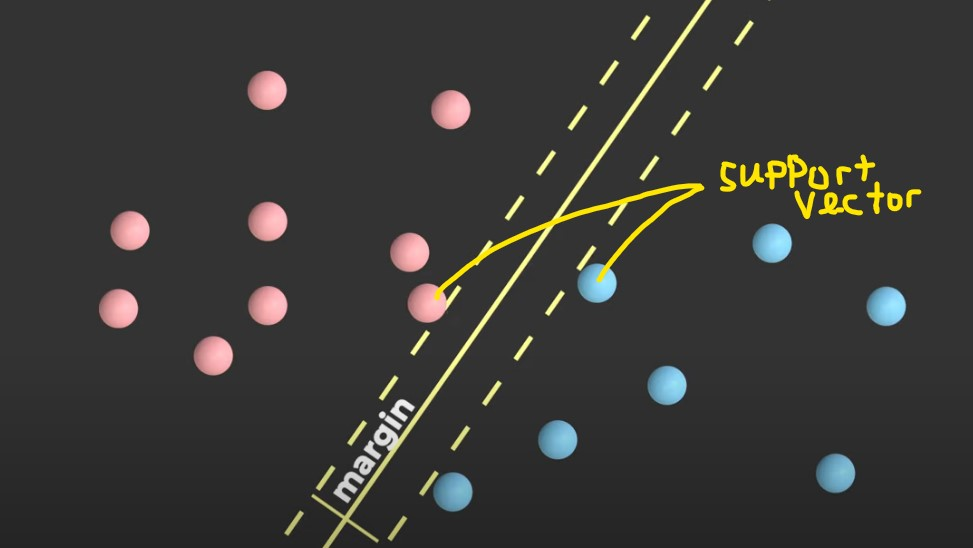

Under the hood, SVM menyelesaikan Convex Optimization Problem yang memaksimalkan margin tersebut:

$$max_w,_b ||w||^{-2}$$

With constraints the class point must be on the correct side of the hyperplane:

$$w^T * x_1 + b \ge 1 \space\space \forall x_1 \in C_1$$

<br>

$$w^T * x_2 + b \le -1 \space\space \forall x_2 \in C_2$$

**Example Implementation:**

```python
from sklearn.svm import SVC

X = [
[0.1, 2.3],
[-1.5, 2.5],
[2.0, -4.3],
# ...
]

y = [0, 1, 1, ] # ...

clf = SVC()
clf.fit(X, y)
```

Traditional SVM using linear boundaries is an advantage because it is easy to implement, but it is also a limitation.

For most cases, points cannot be separated using linear boundaries.

A common workaround in this case is to

1. Augment the data with non-linear functions to a higher dimension.

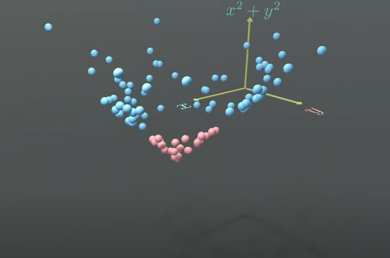

2. Find the hyperplane that separates the two classes.

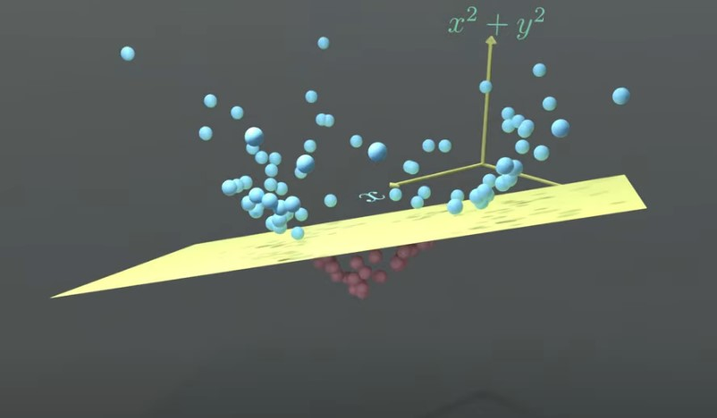

3. Project back to the original dimensions.


**Example Implementation:**

```python
from sklearn.svm import SVC

X = [
    [0.1, 2.3],
    [-1.5, 2.5],
    [2.0, -4.3],
    # ...
]

y = [0, 1, 1, ] # ...

# non-linear transformation x^2 + y^2
fX = [ (x[0], x[1], x[0]**2 + x[1]**2) for x in X]

clf = SVC()
clf.fit(fX, y)
```

But this approach has a major problem, which is that we have to determine the non-linear function, which is quite difficult especially in data with many features. Another problem is that if we want a complex decision boundary, we need to increase the dimension of the output non-linear function which will add time and/or computational power.

#### The Kernel Trick

The kernel trick was created as a solution to both problems. The concept is that the SVM algorithm does not need to know every point mapped in the non-linear function, but how a point compares to other points after being transformed.

Mathematically, this is equal to the inner product of a point transformation $x$ with another point transformation $x'$, this quantity is called the kernel function:

$$k(x, x') = f(x)^T * f(x')$$

Here are some examples of kernel functions:

- Linear Kernel (flat decision boundary)

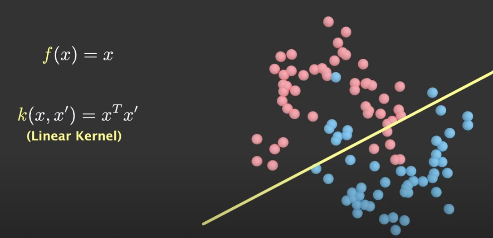

- Polynomial Kernel (curvy decision boundary)

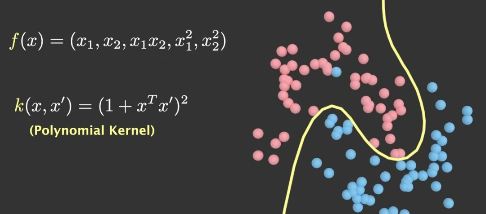

- RBF Kernel (infinite dimensional function)

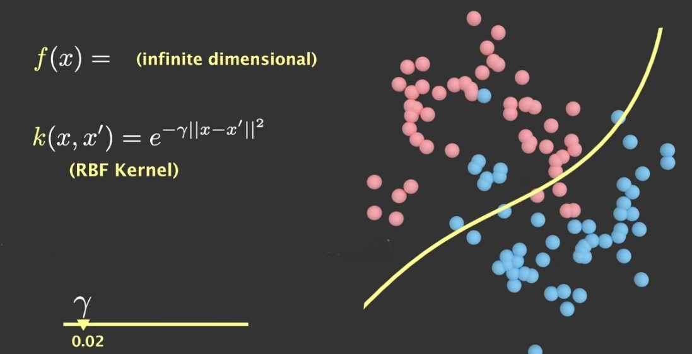

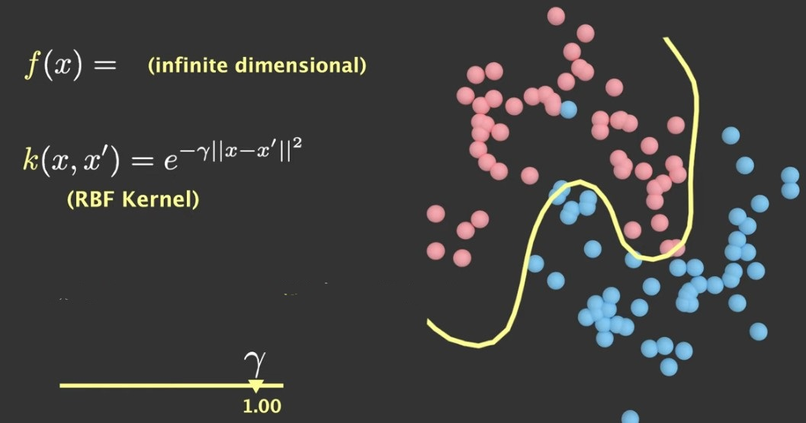

**Example Implementation:**

```python
# ...

clf = SVC(kernel='linear')
clf = SVC(kernel='poly')
clf = SVC(kernel='rbf', gamma=0.02)

# ...
```

## Machine Learning Techniques (Bonus)

### Cross-Validation (CV)

Cross-Validation, or out-of-sample testing, is a resampling technique used to evaluate model performance on unseen data, reducing the risk of overfitting. The technique involves dividing the dataset into multiple folds, using each fold as a test set by training the other folds on the model. This process is repeated multiple times, with each fold serving as a test set once.

#### K-Fold

One CV method is K-Fold, where the dataset is divided into `k` folds of equal size. The model is trained `k` times, each time using a different fold as the test set and the remaining `k-1` folds as the train set. The performance is then averaged over all `k` trials to get an estimate of the model performance.

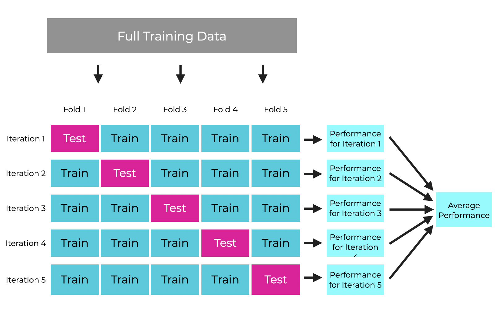

For example, suppose there is a dataset with 100 data points and we specify the number of folds `k = 5`. This means K-Fold will have 5 folds, each with 20 data points.

| Iterations | Train Set       | Test Set |
| ---------- | --------------- | -------- |
| 1          | Fold 2, 3, 4, 5 | Fold 1   |
| 2          | Fold 1, 3, 4, 5 | Fold 2   |
| 3          | Fold 1, 2, 4, 5 | Fold 3   |
| 4          | Fold 1, 2, 3, 5 | Fold 4   |
| 5          | Fold 1, 2, 3, 4 | Fold 5   |

**Example Implementation:**

```python
from sklearn.model_selection import KFold

kf = KFold(n_splits=5, shuffle=True, random_state=42)

for train_index, test_index in kf.split(X):
    X_train, X_test = X[train_index], X[test_index]
    y_train, y_test = y[train_index], y[test_index]

    model.fit(X_train, y_train)

    y_pred = model.predict(X_test)

    accuracy = accuracy_score(y_test, y_pred)
    print(f “Fold accuracy: {accuracy:.4f}”)
```

#### Stratified K-Fold

The variant of the K-Fold is the Stratified K-Fold. It works more or less the same as K-Fold, however, it ensures that each fold has almost the same percentage of samples for each target class. This is especially useful when dealing with imbalance datasets, where some classes are less than others.

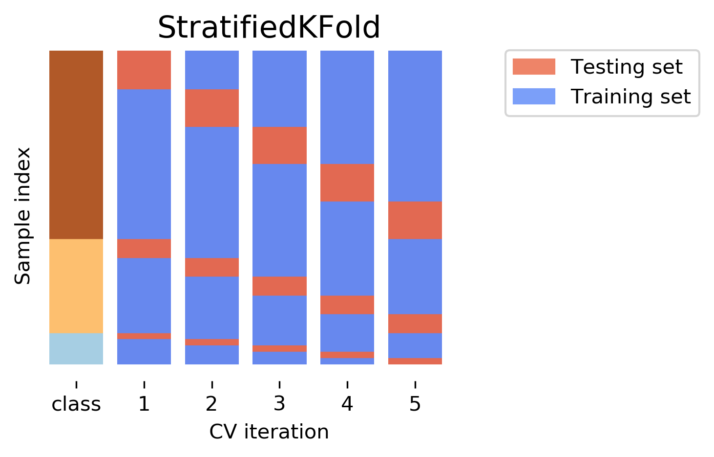

**Example Implementation:**

```python
from sklearn.model_selection import StratifiedKFold

skf = StratifiedKFold(n_splits=5, shuffle=True, random_state=42)

for train_index, test_index in skf.split(X, y):
    X_train, X_test = X[train_index], X[test_index]
    y_train, y_test = y[train_index], y[test_index]

    model.fit(X_train, y_train)

    y_pred = model.predict(X_test)

    accuracy = accuracy_score(y_test, y_pred)
    print(f “Fold accuracy: {accuracy:.4f}”)
```

or use the (easier) alternative, `cross_val_scorer`

```python
from sklearn.model_selection import cross_val_score, KFold

kf = KFold(n_splits=5, shuffle=True, random_state=42)
# or use skfold

scores = cross_val_score(model, X, y, cv=kf, scoring='accuracy')

print(f “Fold accuracies: {scores}”)
print(f “Mean accuracy: {scores.mean():.4f}")
```

### Hyperparameter Tuning

The process of optimizing machine learning model parameters that are not learned from the data but are set before the training process (by us). These parameters, known as hyperparameters, control the behavior of the training algorithm and the structure of the model, such as the number of neighbors in K-Nearest Neighbors (KNN), or the depth of a decision tree.

Common Methods for Hyperparameter Tuning:

- **Grid Search**: A brute force method, in which all predefined hyperparameter combinations are tested to find the best one. This method is effective but can be computationally expensive.

```python
from sklearn.model_selection import GridSearchCV

model = RandomForestClassifier()

param_grid = {
    'n_estimators': [10, 50, 100],
    'max_depth': [None, 10, 20],
    'min_samples_split': [2, 5, 10]
}

grid_search = GridSearchCV(estimator=model, param_grid=param_grid, cv=5, scoring='accuracy')

grid_search.fit(X, y)

print("Best parameters found: ”, grid_search.best_params_)
print("Best cross-validation score: ”, grid_search.best_score_)
```

- **Random Search**: Randomly samples combinations of hyperparameters. This can be more efficient than grid search because it explores a larger hyperparameter space with fewer evaluations.

```python
from sklearn.model_selection import RandomizedSearchCV

param_dist = {
    'n_estimators': randint(10, 200),
    'max_depth': [None, 10, 20, 30],
    'min_samples_split': randint(2, 11)
}

random_search = RandomizedSearchCV(estimator=model, param_distributions=param_dist, n_iter=20, cv=5, scoring='accuracy', random_state=42)

random_search.fit(X, y)

print("Best parameters found: ", random_search.best_params_)
print("Best cross-validation score: ", random_search.best_score_)
```

- **Bayesian Optimization**: Uses probabilistic models to find optimal hyperparameters, balancing exploration and exploitation, which can be more efficient than random or grid search. One algorithm that uses this model is TPE (Tree Parzen Optimizer).

```python
import optuna

def objective(trial):
    n_estimators = trial.suggest_int('n_estimators', 10, 200)
    max_depth = trial.suggest_int('max_depth', 1, 30)
    min_samples_split = trial.suggest_int('min_samples_split', 2, 10)

    model = RandomForestClassifier(
        n_estimators=n_estimators,
        max_depth=max_depth,
        min_samples_split=min_samples_split,
        random_state=42
    )

    score = cross_val_score(model, X, y, cv=5, scoring='accuracy').mean()
    return score

study = optuna.create_study(direction='maximize')
study.optimize(objective, n_trials=50)

print("Best parameters found: ”, study.best_params)
print("Best cross-validation score: ”, study.best_value)
```
