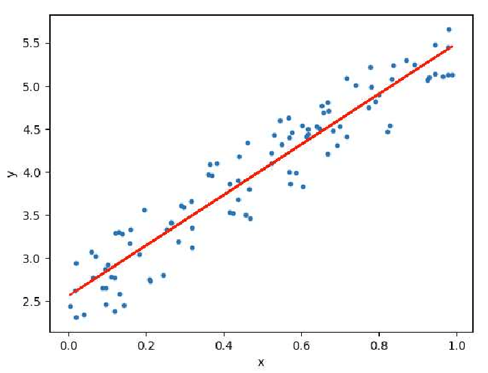
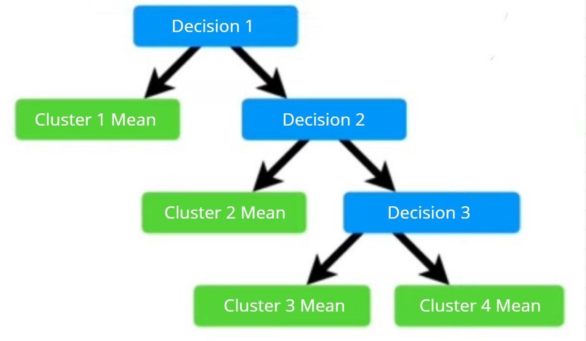
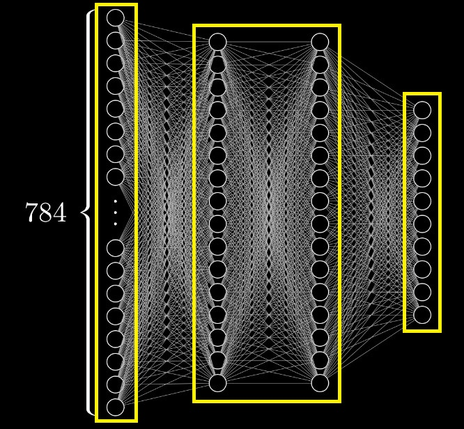
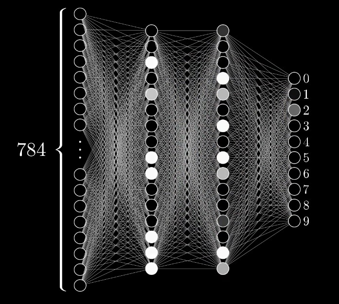

# Module 3: Supervised Learning - Regression

## Table of Contents

- [Module 3: Supervised Learning - Regression](#modul-3-supervised-learning---regression)
  - [Table of Contents](#list-of-contents)
  - [Introduction](#introduction)
  - [Algorithm](#algorithm)
    - [Linear Regression](#linear-regression)
      - [Quantifying Best Fit](#quantifying-best-fit)
      - [Linear Regression, too simple?](#linear-regression-too-simple)
    - [Regression Tree](#regression-tree)
      - [Optimal Split](#optimal-split)
    - [Neural Networks](#neural-networks)
      - [Gradient Descent](#gradient-descent)
      - [Backpropagation](#backpropagation)

## Introduction

Regression is a supervised learning technique for predicting continuous values (e.g. company revenue).

## Algorithm

### Linear Regression

When looking at the distribution of data, there is a kind of general movement pattern where the distribution goes up or down over time. If we draw a line that follows the direction of the rise and fall of the distribution, the line is like following an overall “trend”.



It is basically a Linear Regression algorithm, such as fitting a trend line to the data distribution. In general, a linear function $f(x)$ is defined as:

$$
f(x) = \alpha x + \beta
$$

Where:

- $\alpha$ is the slope or gradient of the line
- $\beta$ is the bias or y-intercept (y-offset)

Both are trainable parameters, in the sense that the model will search for the best $\alpha$ and $\beta$ to make the line fit the data trend as closely as possible.

#### Quantifying Best Fit

One way to measure how well the line fits each piece of data is to compare where the point in the prediction $f(x)$ is with where the point should be $y$, generally through distance or sum of squared errors:

$$
SSE = \sum_i (f(x_i) - y_i)^2 = \sum_i (\alpha x + \beta - y_i)^2
$$

Since squared error compares distance, it means that the smaller the error, the closer our model prediction is to the true value. Therefore, we want to minimize the SSE by determining the values of $\alpha$ and $\beta$ that minimize the SSE. Recalling the calculus course, the way to get the minimum value of a function $f(x)$ is through the partial derivative $f'(x) = 0$.

Partial derivative of SSE with respect to $\alpha$:

$$
\frac{\partial SSE}{\partial \alpha} = 2 \sum_i (\alpha x_i + \beta - y_i) x_i
$$

Since $\frac{\partial SSE}{\partial \alpha} = 0$, then:

$$
\alpha = \frac{\sum_i x_i y_i - \frac{1}{n} \sum_i x_i \sum_i y_i}{\sum_i x_i^2 - \left(\frac{1}{n} \sum_i x_i\right)^2}
$$

Do the same for the partial derivative of SSE with respect to $\beta$:

$$
\frac{\partial SSE}{\partial \beta} = 2 \sum_i(\alpha x_i + \beta - y_i)
$$

Since, $\frac{\partial SSE}{\partial \beta} = 0$, then:

$$
\beta = \frac{1}{n} \sum_i y_i - \alpha \cdot \frac{1}{n} \sum_i x_i
$$

Thus, we only need to use the closed-form solution above to directly get the best fit line without the need to change the line iteratively. This method is called Ordinary Least Squares (OLS) which is also used in the Linear Regression implementation of scikit-learn library. As a little addition, there is another method of solving linear regression using Gradient Descent (GD). Essentially GD method iteratively updates the values of $\alpha$ and $\beta$ (it doesn't have a closed-form solution so it's definitely slower but flexible).

**Implementation Example:**

```py
from sklearn.linear_model import LinearRegression

X = [[1], [2], [3], [4], [5], [6]] # ...
y = [2, 2.5, 4.5, 3, 5, 4.7] # ...

reg = LinearRegression()
reg.fit(X, y)
```

#### Linear Regression, too simple?

For some cases it is, for example in the following data:


Fitting a line to the distribution as shown above will not be very helpful.

Although linear regression may seem too simple for regression, this simplicity is its strength. In most cases, Linear Regression is extensible. Suppose there are many features in the dataset:

$$
f(x) = \alpha_1 x_1 + \alpha_2 x_2 + \alpha_3 x_3 + ...
$$

or maybe we want to add non-linear features:

$$
f(x) = \alpha x + \beta x^2 + \gamma sin(x) + ...
$$

\*The above example is important to remember because linear regression is the backbone for Neural Network and Deep Learning algorithm approaches.

### Regression Tree

Although it may seem strange to use a tree model for continuous value prediction, this approach is actually quite intuitive especially if we look at the distribution of data as a region or cluster. The main idea of regression tree is to divide the data into smaller regions that are more homogeneous in terms of the target variable, and then make predictions based on the average (or other aggregation) of the data values within each region.


So, the decision tree of the regression tree will more or less look like the following:



#### Optimal Split

The way regression tree determines regions is more or less similar to DT in general. But where DT minimizes impurity, regression tree minimizes Variance. For each data point, find a threshold between the points that minimizes the variance of the resulting region.

Suppose in the tree, node $t$ has $N_t$ data with target values $y_1, y_2, ..., y_n$. The variance at that node $Var(t)$ is:

$$
Var(t) = \frac{1}{N_t} \sum_{i=1}^{N_t}(y_i - \bar{y_t})^2
$$

where $\bar{y_t}$ is the mean of the target value at node $t$:

$$
\bar{y_t} = \frac{1}{N_t} \sum_{i=1}^{N_t} y_i
$$

Since each node can have multiple regions (region is synonymous with split), use the total variance weighted by the amount of data in each region as a measure of how good the split is. Suppose node $t$ has left $t_l$ and right $t_r$ child nodes, then the total variance is:

$$
Total \space Variance = \frac{N_l}{N_t}Var(t_l) + \frac{N_r}{N_t}Var(t_r)
$$

The algorithm uses the split with the smallest total variance.

After the tree is created, each terminal node (leaf) represents a region $R_m$, and the final prediction for a new data point $x$ is the average of the target values $y_i$ in that region:

$$
\hat{y}(x) = \frac{1}{N_m}\sum_{i\in R_m}y_i
$$

In other words, the prediction for each new data point is the average target value of all training data points that belong to the same region (leaf).

**Example Implementation:**

```py
from sklearn.tree import DecisionTreeRegressor

X = [[1], [2], [3], [4], [5], [6]] # ...
y = [2, 2.5, 4.5, 3, 5, 4.7] # ...

reg = DecisionTreeRegressor(random_state=42)
reg.fit(X, y)
```

### Neural Networks

As the name suggests, neural networks are inspired by the way neuron networks work in the human brain in biology. For the time being, think of a neuron as something that holds a value ~range[0, 1].


For example on a 28x28 pixel grid, we can think of each pixel as a neuron (total 28x28=784 neurons). Each neuron above holds a number that represents the grayscale value of the pixel (0 black pixel, 1 white pixel), the value held by this neuron is called activation. All 784 neurons form the first layer of our neural network.



Generally, neural networks are divided into three parts, the first layer is Input Layer. The second layer Hidden Layer, where the computation of feature calculations will be handled. The last layer is the Output Layer, which gives the final result of the calculation. One thing to note, the number of neurons in the hidden layer is arbitrary depending on how complex our model is (to be explained further).

The way the network works, the activation in one layer determines the activation of the next layer, and of course the essence of the network as an information processing mechanism falls on how the activation of one layer results in the activation of the next layer. This is analogous to how in biological neuron networks, some groups of active neurons cause other groups of neurons to activate and is the motivation behind the structure of networks that have more than 1 layer.



So the question now is, how exactly does the activation on one layer determine the activation on the next layer?


As with the weighted graph, assign a weight $w$ to each connection between a neuron and a neuron from the previous layer (these weights are just numbers). Then take all the activations $a$ from the previous layer and calculate the weighted sum based on those weights:

$$
a_0^{(1)} = w_{0,0} \times a_0^{(0)} + w_{0,1} \times a_1^{(0)} + w_{0,2} \times a_2^{(0)} + ... + w_{0,n} \times a_n^{(0)}
$$

Think of these weights as representing how important they are to a neuron. So the weighted sum of all neuron values actually just adds up the neuron values only in the region we care about.

When calculating a weighted sum like this, we can get any number. However, often we want to change the number to follow a certain rule or range, a common thing to do is to put the weighted sum into a non-linear function. The function used to transform the weighted sum is called activation function, denoted as $\sigma$:

$$
a_0^{(1)} = \sigma(w_{0,0} \times a_0^{(0)} + w_{0,1} \times a_1^{(0)} + w_{0,2} \times a_2^{(0)} + ... + w_{0,n} \times a_n^{(0)}))
$$

However, we may only want the neuron to activate when the weighted sum is greater than a certain number, say, 5. What can be done is to add another number like -5 to this weighted sum before putting it into the activation function. That extra number is called bias, denoted $b$.

$$
a_0^{(1)} = \sigma(w_{0,0} \times a_0^{(0)} + w_{0,1} \times a_1^{(0)} + w_{0,2} \times a_2^{(0)} + ... + w_{0,n} \times a_n^{(0)} - b_0)
$$

Each neuron in a layer will be connected to all the neurons of the previous layer, and each connection of the neuron has its own weight and each neuron has a bias. So when we talk about machine learning, learning is about making the computer find the best settings for all those numbers so that it can actually solve the problem at hand.

The neuron function above is a bit difficult to write especially if we want to denote the value of all neurons in a layer. If there is a layer with $n$ neurons and the previous layer has $k$ neurons, a more concise (and standard) way to notationally represent these connections is:

$$
\sigma\left(
\begin{bmatrix}
w_{0,0} & w_{0,1} & \cdots & w_{0,n} \\\
w_{1,0} & w_{1,1} & \cdots & w_{1,n} \\
\vdots & \vdots & \ddots & \vdots \\
w_{k,0} & w_{k,1} & \cdots & w_{k,n} \\
\end{bmatrix}
\begin{bmatrix}
a_0^{(0)} \\
a_1^{(0)} \\
\vdots\\
a_n^{(0)}\\
\end{bmatrix}
+
\begin{bmatrix}
b_0 \\
b_1 \\
\vdots\\
b_n\\
\end{bmatrix}\right) =
\begin{bmatrix}
a_0^{(1)} \\
a_1^{(1)} \\
\vdots\\\
a_n^{(1)}\\\
\end{bmatrix}
$$

If we annotate each vector further, suppose $W$ the weight vector between the two layers, $a^{(i)}$ the activation value vector, and $b$ the bias vector, then:

$$
a^{(i)} = \sigma(Wa^{(i-1)} + b)
$$

Early on we saw that a neuron is just something that stores a number, but the specific number stored depends on the value we input, so it's actually more accurate to think of each neuron as a function.

**Example Implementation:**

```python
from tensorflow import keras
from tensorflow.keras import layers

# Define the model
model = keras.Sequential()

# Input layer
model.add(layers.InputLayer(input_shape=input_shape))

# 1st hidden layer, 10 neurons and ReLU activation
model.add(layers.Dense(10, activation='relu'))

# 2nd hidden layer, 5 neurons and ReLU activation
model.add(layers.Dense(5, activation='relu'))

# For regression, output layer has 1 neuron.
model.add(layers.Dense(1))
```

#### Gradient Descent

Like linear regression, the measure of how well the model performs is the distance of the predicted data to the actual squared (Sum of Squared Error) averaged, the error can also be called cost. But just telling whether the model performs well or not is not useful, we want to tell how to change the weights and biases so that the performance is better. Given a cost function for parameter $\theta$ (i.e. weight or bias) denoted $C(\theta)$, how to find the weight that minimizes the value of this function?

$$
C(\theta) = \frac{1}{2N} \sum_{i=1}^{N}(y^{(i)} - \hat{y}^{(i)})^2
$$

Going back to calculus, it is sometimes possible to know the minimum explicitly, but that is not always feasible for complex (high-dimensional) functions. A more flexible tactic is to start from any input, and figure out which direction to take to derive that output.


Find out the slope of the current value function, then shift to the left if the slope is positive, and shift the input to the right if the slope is negative. If done repeatedly, the value will get closer to a local minimum of the function, this process is called Gradient Descent (because weights descend from the slope or gradient hehe).

Mathematically, the slope or gradient is the vector of partial derivatives of the cost function against each parameter of a neuron is:

$$
\nabla_\theta C(\theta) = \begin{bmatrix}
\frac{\partial C}{\partial \theta_0}\\\
\frac{\partial C}{\partial \theta_1} \\
\vdots\\
\frac{\partial C}{\partial \theta_n}
\end{bmatrix}
$$

#### Backpropagation

The gradient of a function at a point indicates the direction of steepest increase in the function. So, if we use the original gradient $\nabla_\theta C(\theta)$, we will move in the direction where the cost function $C(\theta)$ is increasing. Based on that, it means that negative values of the gradient ($-\nabla_\theta C(\theta)$) will point towards the sharpest decrease in the cost function.

So, to move $\theta$ to a value that minimizes the cost function, we subtract $\theta$ with a negative gradient:

$$
\theta\leftarrow \theta - \eta\nabla_\theta C(\theta)
$$

Where $\eta$ is the learning rate, controlling how large a step is taken.

The algorithm we just discussed, determining how a single training data change in weight and bias leads to the fastest decrease in cost function, is Backpropagation.

Although the implementation of backpropagation seems complex (it is), most neural networks libraries have abstracted the complexity of the backpropagation implementation as in the following example.

**Example Implementation:**

```py
# Backpropagation already set with mean squared error
model.compile(optimizer='adam', loss='mean_squared_error')

# Train the model
model.fit(X, y, epochs=100, verbose=1)
```

**Full Implementation:**

```py
import numpy as np
from tensorflow import keras
from tensorflow.keras import layers

X = np.array([[1], [2], [3], [4], [5], [6]])
y = np.array([2, 2.5, 4.5, 3, 5, 4.7])

input_shape = X.shape[1:]

model = keras.Sequential()
model.add(layers.InputLayer(input_shape=input_shape))
model.add(layers.Dense(10, activation='relu'))
model.add(layers.Dense(1))

model.compile(optimizer='adam', loss='mean_squared_error')

model.fit(X, y, epochs=100, verbose=1)
```
