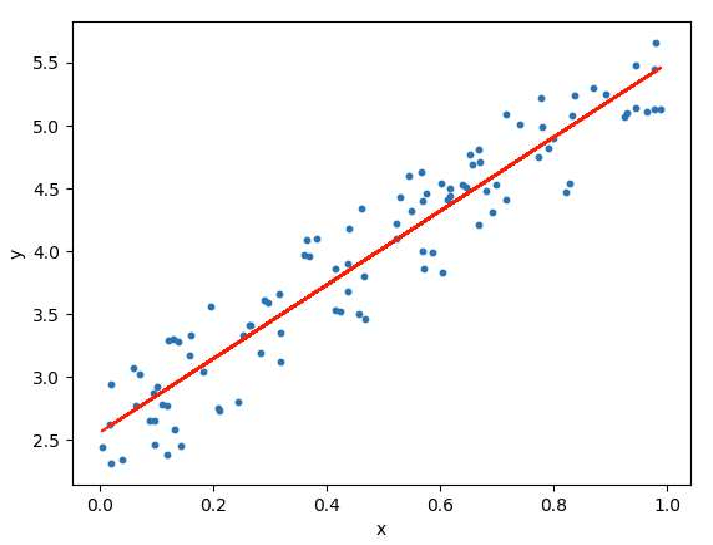
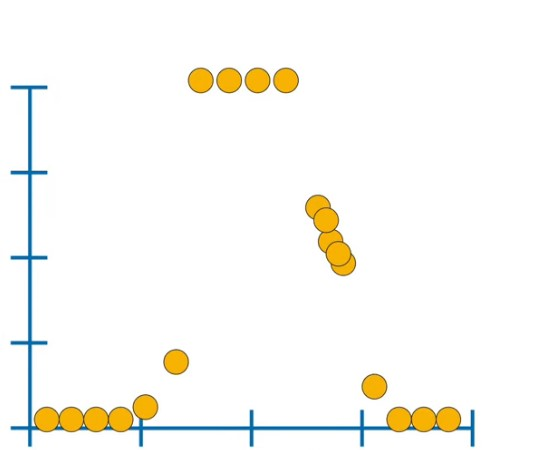
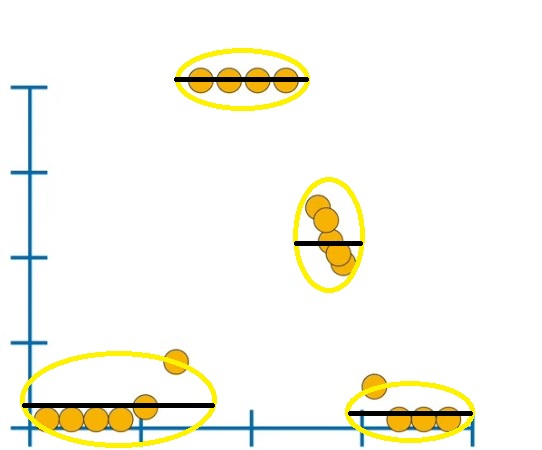
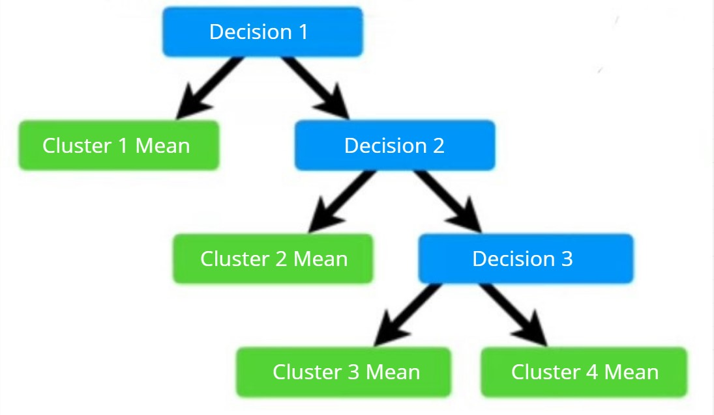
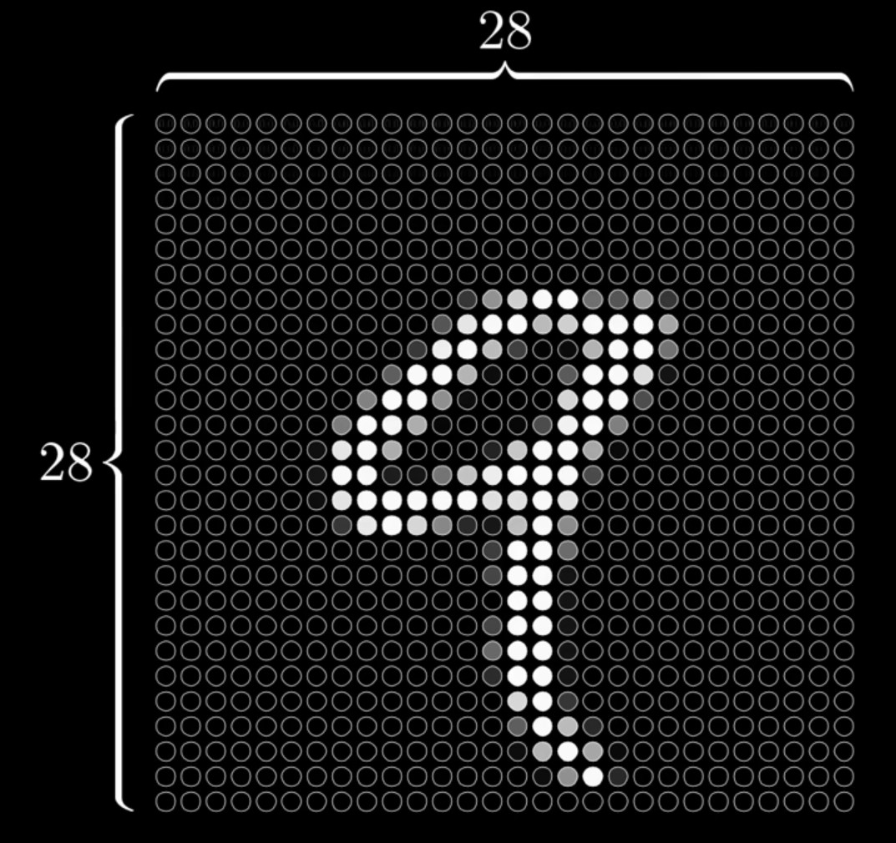
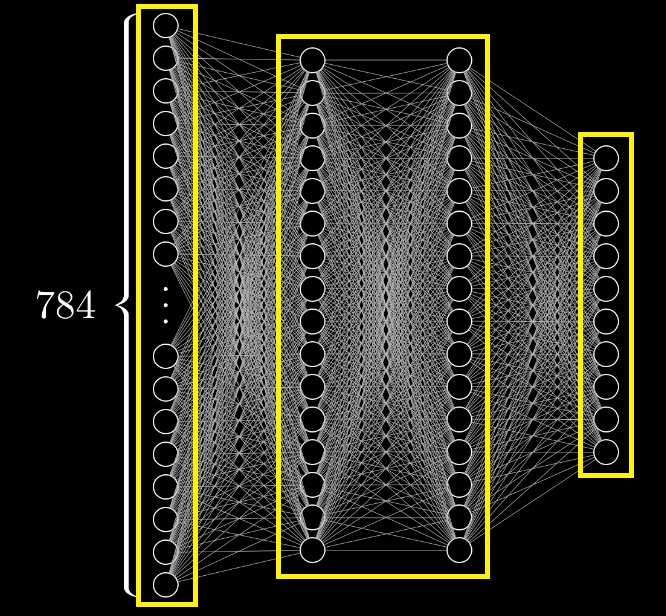
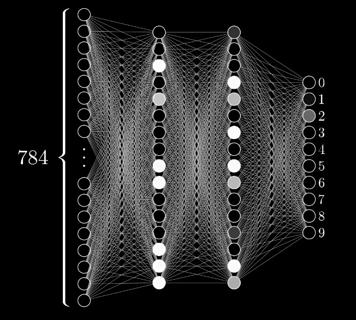
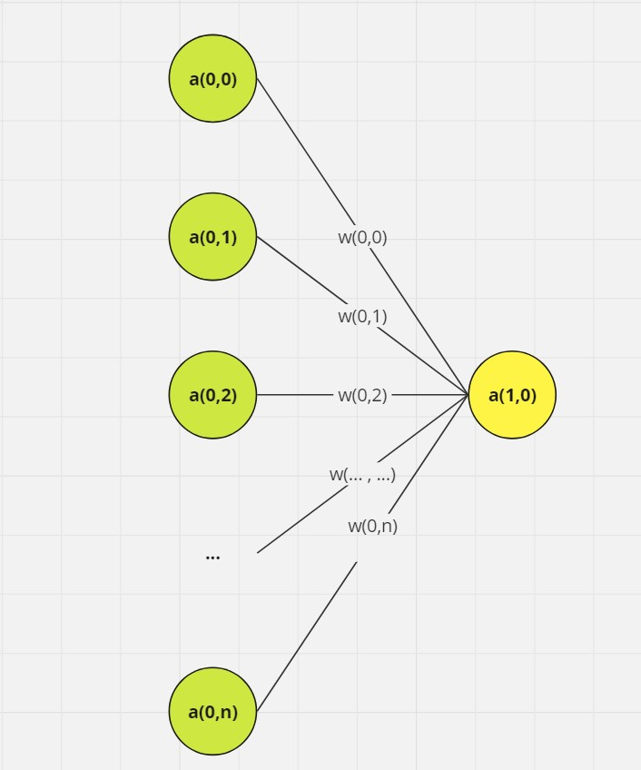
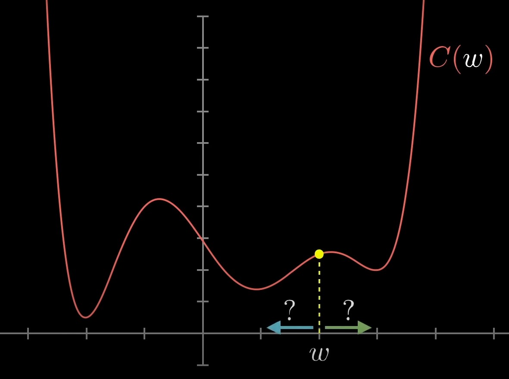

# Modul 3: Supervised Learning - Regression

## Daftar Isi
- [Modul 3: Supervised Learning - Regression](#modul-3-supervised-learning---regression)
  - [Daftar Isi](#daftar-isi)
  - [Pengenalan](#pengenalan)
  - [Algoritma](#algoritma)
    - [Linear Regression](#linear-regression)
      - [Quantifying Best Fit](#quantifying-best-fit)
      - [Linear Regression, too simple?](#linear-regression-too-simple)
    - [Regression Tree](#regression-tree)
      - [Optimal Split](#optimal-split)
    - [Neural Networks](#neural-networks)
      - [Gradient Descent](#gradient-descent)
      - [Backpropagation](#backpropagation)


## Pengenalan
Regresi adalah teknik supervised learning untuk memprediksi nilai kontinu (misal pendapatan perusahaan).

## Algoritma
### Linear Regression
Saat melihat persebaran data, terdapat semacam pola gerakan umum dimana persebaran tersebut naik atau turun seiring berjalannya waktu. Jika Kita menggambar garis yang mengikuti arah naik turunnya persebaran, garis tersebut seperti mengikuti "tren" secara keseluruhan.



Hal tersebut pada dasarnya adalah algoritma Linear Regression, seperti menyesuaikan garis tren ke persebaran data. Secara umum, fungsi linear $f(x)$ didefinikan sebagai:

$f(x) = \alpha x + \beta$

Dimana:
- $\alpha$ adalah slope atau gradien dari garis
- $\beta$ adalah bias atau y-intercept (y-offset)

Keduanya adalah trainable parameter, dalam artian model akan mencari $\alpha$ dan $\beta$ terbaik agar garis se-sesuai mungkin dengan tren data. 

#### Quantifying Best Fit
Salah satu cara untuk mengukur seberapa sesuai garis dengan setiap data adalah dengan membandingkan dimana letak titik pada prediksi $f(x)$ dengan dimana letak titik seharusnya $y$, umumnya melalui jarak atau selisih kuadrat (Sum of Squared Error):

$SSE = \sum_i (f(x_i) - y_i)^2 = \sum_i (\alpha x + \beta - y_i)^2$

Karena squared error membandingkan jarak, berarti semakin kecil error, maka semakin dekat prediksi model kita dengan nilai sesungguhnya. Oleh karena itu, kita ingin meminimalkan SSE dengan menentukan nilai $\alpha$ dan $\beta$ yang meminimalkan SSE. Mengingat kembali mata kuliah kalkulus, cara untuk mendapatkan nilai minimal suatu fungsi $f(x)$ adalah melalui turunan parsial $f'(x) = 0$.

Turunan parsial SSE terhadap $\alpha$:

$\frac{\partial SSE}{\partial \alpha} = 2 \sum_i (\alpha x_i + \beta - y_i) x_i$

Karena $\frac{\partial SSE}{\partial \alpha} = 0$, maka:

$\alpha = \frac{\sum_i x_i y_i - \frac{1}{n} \sum_i x_i \sum_i y_i}{\sum_i x_i^2 - \left(\frac{1}{n} \sum_i x_i\right)^2}$

Lakukan yang sama untuk turunan parsial SSE terhadap $\beta$:

$\frac{\partial SSE}{\partial \beta} = 2 \sum_i (\alpha x_i + \beta - y_i)$

Karena, $\frac{\partial SSE}{\partial \beta} = 0$, maka:

$\beta = \frac{1}{n} \sum_i y_i - \alpha \cdot \frac{1}{n} \sum_i x_i$

Dengan demikian, kita hanya perlu menggunakan closed-form solution diatas untuk langsung mendapatkan garis best fit tanpa perlu merubah garis secara iteratif. Metode ini disebut sebagai Ordinary Least Squares (OLS) yang juga digunakan pada implementasi Linear Regression library scikit-learn. Sebagai sedikit tambahan, ada metode penyelesaian linear regression lain menggunakan Gradient Descent (GD). Intinya GD metode ini secara iteratif mengupdate nilai $\alpha$ dan $\beta$ (tidak memiliki closed-form solution jadi pasti lebih lambat namun fleksibel).

**Contoh Implentasi:**
```py
from sklearn.linear_model import LinearRegression

X = [[1], [2], [3], [4], [5], [6]] # ...
y = [2, 2.5, 4.5, 3, 5, 4.7] # ...

reg = LinearRegression()
reg.fit(X, y)
```

#### Linear Regression, too simple?
Untuk beberapa kasus iya, sebagai contoh pada data berikut:



Menyocokkan garis pada persebaran seperti gambar diatas tidak akan terlalu membantu.

Meskipun linear regression mungkin terlihat terlalu sederhana untuk regresi, kesederhanaan inilah yang menjadi kelebihannya. Pada kebanyakan kasus, Linear Regression extensible. Misalkan pada dataset terdapat banyak fitur:

$f(x) = \alpha_1 x_1 + \alpha_2 x_2 + \alpha_3 x_3 + ...$

atau mungkin kita ingin menambahkan fitur non-linear:

$f(x) = \alpha x + \beta x^2 + \gamma sin(x) + ...$

*Contoh diatas penting diingat karena linear regression menjadi backbone untuk pendekatan algoritma Neural Network dan Deep Learning.

### Regression Tree
Walaupun terlihat aneh menggunakan tree model untuk prediksi nilai kontinu, pendekatan ini sebenarnya cukup intuitif terutama jika persebaran data kita lihat seperti suatu region atau cluster. Ide utama regression tree adalah membagi data menjadi region yang lebih kecil yang lebih homogen dalam hal variabel target, dan kemudian membuat prediksi berdasarkan rata-rata (atau agregasi lain) nilai data dalam setiap region.



Jadi, decision tree dari regression tree kurang lebih akan terlihat seperti berikut:



#### Optimal Split
Cara regression tree menentukan region kurang lebih mirip dengan DT in general. Tetapi dimana DT dengan meminimalkan impurity, regression tree meminimalkan Varians. Untuk setiap titik data, cari suatu threshold antara titik yang meminimalkan varians dari region yang dihasilkan. 

Misalkan pada tree, node $t$ memiliki $N_t$ data dengan nilai target $y_1, y_2, ..., y_n$. Varians di node tersebut $Var(t)$ adalah:

$Var(t) = \frac{1}{N_t} \sum_{i=1}^{N_t} (y_i - \bar{y_t})^2$

dimana $\bar{y_t}$ adalah mean dari nilai target pada node $t$:

$\bar{y_t} = \frac{1}{N_t} \sum_{i=1}^{N_t} y_i$

Karena setiap node bisa memiliki banyak region (region sinonim dengan split), gunakan total varians yang dibobotkan dengan banyaknya data pada setiap region tersebut sebagai ukuran bagusnya split. Misalkan node $t$ memiliki child node kiri $t_l$ dan kanan $t_r$, maka total varians adalah:

$Total \space Variance = \frac{N_l}{N_t}Var(t_l) + \frac{N_r}{N_t}Var(t_r)$

Algoritma menggunakan split dengan total varians terkecil.

Setelah tree dibuat, setiap terminal node (leaf) mewakili region $R_m$, dan prediksi akhir untuk titik data baru $x$ adalah rata-rata nilai target $y_i$ di region tersebut:

$\hat{y}(x) = \frac{1}{N_m} \sum_{i \in R_m}y_i$

Dengan kata lain, prediksi untuk setiap titik data baru adalah nilai target rata-rata dari semua titik data pelatihan yang termasuk dalam region yang sama (leaf).

**Contoh Implementasi:**
```py
from sklearn.tree import DecisionTreeRegressor

X = [[1], [2], [3], [4], [5], [6]] # ...
y = [2, 2.5, 4.5, 3, 5, 4.7] # ...

reg = DecisionTreeRegressor(random_state=42)
reg.fit(X, y)
```

### Neural Networks
Seperti namanya, neural network terinspirasi dari cara kerja jaringan neuron pada otak manusia di biologi. Untuk sementara, anggap neuron sebagai sesuatu yang memegang nilai ~ range[0, 1].



Misalnya pada pixel grid 28x28, setiap pixel bisa kita anggap sebagai neuron (total 28x28=784 neuron). Setiap neuron diatas memegang angka yang merepresentasikan nilai grayscale dari pixel tersebut (0 pixel hitam, 1 pixel putih), nilai yang dipegang neuron ini disebut activation. Seluruh 784 neuron ini membentuk layer (lapisan) pertama dari neural network kita.



Umumnya neural network dibagi menjadi tiga bagian, layer pertama Input Layer. Layer kedua Hidden Layer, dimana komputasi perhitungan fitur akan ditangani. Layer terakhir Output Layer, memberikan hasil akhir perhitungan. One thing to note, banyak neuron pada hidden layer arbitrary tergantung ingin seberapa kompleks model kita (akan dijelaskan lebih lanjut).

Cara network bekerja, aktivasi dalam satu layer menentukan aktivasi layer berikutnya, dan tentu saja inti dari network sebagai mekanisme pemrosesan informasi jatuh pada bagaimana aktivasi dari satu layer menghasilkan aktivasi di layer berikutnya. Cara kerja ini dianalogikan dengan bagaimana dalam jaringan neuron biologis, beberapa kelompok neuron yang aktif menyebabkan kelompok neuron lain untuk aktif serta menjadi motivasi dibalik struktur network yang memiliki lebih dari 1 layer.



Jadi pertanyaannya sekarang adalah, bagaimana tepatnya aktivasi pada satu layer dapat menentukan aktivasi pada layer berikutnya?



Seperti pada weighted graph, tetapkan bobot $w$ pada setiap koneksi antara neuron dengan neuron dari layer sebelumnya (bobot ini hanyalah angka). Lalu ambil semua aktivasi $a$ dari layer sebelumnya dan hitung weighted sum berdasarkan bobot tersebut:

$a_0^{(1)} = w_{0,0} \times a_0^{(0)} + w_{0,1} \times a_1^{(0)} + w_{0,2} \times a_2^{(0)} + ... + w_{0,n} \times a_n^{(0)}$

Pikirkan bobot ini sebagai gambaran seberapa pentingnya bobot tersebut bagi suatu neuron. Jadi weighted sum dari semua nilai neuron sebenarnya hanya menambahkan nilai neuron hanya di region yang kita pedulikan saja.

Saat menghitung weighted sum seperti ini, kita dapat memperoleh angka apa pun. Namun, sering kali kita ingin mengubah angka tersebut agar mengikuti suatu aturan atau rentang tertentu, hal yang umum dilakukan adalah memasukkan weighted sum ini ke dalam suatu non-linear function. Fungsi yang digunakan untuk merubah weighted sum ini biasa disebut activation function, dinotasikan sebagai $\sigma$:

$a_0^{(1)} = \sigma(w_{0,0} \times a_0^{(0)} + w_{0,1} \times a_1^{(0)} + w_{0,2} \times a_2^{(0)} + ... + w_{0,n} \times a_n^{(0)})$

Namun, mungkin kita hanya ingin neuron tersebut aktif saat weighted sum lebih besar dari suatu angka tertentu, katakanlah, 5. Yang dapat dilakukan adalah menambahkan angka lain seperti -5 ke weighted sum ini sebelum memasukkannya ke dalam activation function. Angka tambahan itu disebut bias, dinotasikan $b$.

$a_0^{(1)} = \sigma(w_{0,0} \times a_0^{(0)} + w_{0,1} \times a_1^{(0)} + w_{0,2} \times a_2^{(0)} + ... + w_{0,n} \times a_n^{(0)} - b_0)$

Setiap neuron dalam suatu layer akan terhubung ke semua neuron dari layer sebelumnya, dan masing-masing koneksi dari neuron tersebut memiliki bobotnya sendiri serta masing-masing neuron memiliki bias. Jadi saat kita berbicara tentang machine learning, learning yang dimaksud di sini adalah membuat komputer menemukan pengaturan yang terbaik untuk semua angka tersebut sehingga benar-benar dapat memecahkan masalah yang dihadapi.

Fungsi neuron diatas agak sulit ditulis terutama jika kita ingin menotasikan nilai seluruh neuron pada suatu layer. Jika terdapat suatu layer dengan $n$ neuron dan pada layer sebelumnya terdapat $k$ neuron, cara yang lebih ringkas (dan standar) secara notasi untuk merepresentasikan koneksi ini adalah:

$$
\sigma \left(
\begin{bmatrix}
w_{0,0} & w_{0,1} & \cdots & w_{0,n} \\
w_{1,0} & w_{1,1} & \cdots & w_{1,n} \\
\vdots & \vdots & \ddots & \vdots \\
w_{k,0} & w_{k,1} & \cdots & w_{k,n} \\
\end{bmatrix}
\begin{bmatrix}
a_0^{(0)} \\
a_1^{(0)} \\
\vdots \\
a_n^{(0)} \\
\end{bmatrix}
+
\begin{bmatrix}
b_0 \\
b_1 \\
\vdots \\
b_n \\
\end{bmatrix}\right) =
\begin{bmatrix}
a_0^{(1)} \\
a_1^{(1)} \\
\vdots \\
a_n^{(1)} \\
\end{bmatrix}
$$

Jika kita anotasikan setiap vector lebih lanjut, misalkan $W$ vektor bobot antar kedua layer, $a^{(i)}$ vektor nilai activation, dan $b$ vektor bias, maka:

$a^{(i)} = \sigma(Wa^{(i-1)} + b)$

Diawal kita melihat neuron hanyalah sesuat yang menyimpan angka, tetapi angka spesifik yang disimpan bergantung pada nilai yang kita masukkan, jadi sebenarnya lebih akurat untuk menganggap setiap neuron sebagai sebuah fungsi.

**Contoh Implementasi:**
```py
from tensorflow import keras
from tensorflow.keras import layers

# Define the model
model = keras.Sequential()

# Input layer
model.add(layers.InputLayer(input_shape=input_shape))

# 1st hidden layer, 10 neurons and ReLU activation
model.add(layers.Dense(10, activation='relu'))

# 2nd hidden layer, 5 neurons and ReLU activation
model.add(layers.Dense(5, activation='relu'))

# For regression, output layer has 1 neuron.
model.add(layers.Dense(1))
```

#### Gradient Descent
Seperti linear regression, tolak ukur dari seberapa bagus model berperforma adalah jarak data prediksi dengan sebenarnya dikuadrat (Sum of Squared Error) yang dirata-ratakan, error bisa juga disebut cost. Tetapi hanya memberi tahu bagus atau tidaknya model berperforma kurang berguna, kita ingin memberi tahu cara mengubah bobot dan bias tersebut sehingga performa lebih baik. Diberikan cost function untuk parameter $\theta$ (misal bobot atau bias) dinotasikan $C(\theta)$, bagaimana menemukan bobot yang meminimalkan nilai fungsi ini?

$C(\theta) = \frac{1}{2N} \sum_{i=1}^{N} (y^{(i)} - \hat{y}^{(i)})^2$

Kembali lagi ke kalkulus, terkadang dapat mengetahui minimum tersebut secara eksplisit, tetapi hal itu tidak selalu layak untuk fungsi yang kompleks (dimensi tinggi). Taktik yang lebih fleksibel adalah memulai dari input mana saja, dan mencari tahu arah mana yang harus diambil untuk menurunkan output tersebut.



Cari tahu slope fungsi nilai sekarang, lalu geser ke kiri jika slope itu positif, dan geser input ke kanan jika slope itu negatif. Jika dilakukan secara berulang, nilai akan semakin mendekati suatu local minimum dari fungsi tersebut, proses ini disebut sebagai Gradient Descent (karena bobot turun dari slope atau gradien hehe).

Secara matematis, slope atau gradien adalah vektor turunan parsial cost function terhadap setiap parameter suatu neuron adalah:

$\nabla_\theta C(\theta) = \begin{bmatrix}
    \frac{\partial C}{\partial \theta_0} \\
    \frac{\partial C}{\partial \theta_1} \\
    \vdots \\
    \frac{\partial C}{\partial \theta_n}
\end{bmatrix}$

#### Backpropagation
Gradien suatu fungsi pada suatu titik menunjukkan arah peningkatan paling curam pada fungsi tersebut. Jadi, jika kita menggunakan gradien asli $\nabla_\theta C(\theta)$, kita akan bergerak ke arah di mana fungsi biaya $C(\theta)$ meningkat. Berdasarkan itu, berarti nilai negatif dari gradien ($-\nabla_\theta C(\theta)$) akan menunjuk ke arah penurunan paling tajam dalam cost function.

Maka, untuk memindahkan $\theta$ ke nilai yang meminimalkan cost function, kita kurangi $\theta$ dengan gradien negatif:

$\theta \lArr \theta - \eta \nabla_\theta C(\theta)$

Dimana $\eta$ adalah learning rate, mengontrol seberapa besar langkah yang diambil.

Algoritma yang barusan kita bahas, menentukan bagaimana satu training data merubah bobot dan bias yang menyebabkan penurunan cost function tercepat, adalah Backpropagation.

Walaupun tampaknya implementasi backpropagation kompleks (memang kompleks seh hehe), sebagian besar library neural networks sudah mengabstraksi kompleksitas implementasi backpropagation seperti pada contoh berikut.

**Contoh Implementasi:**
```py
# Backpropagation already set with mean squared error
model.compile(optimizer='adam', loss='mean_squared_error')

# Train the model
model.fit(X, y, epochs=100, verbose=1)
```

**Implementasi Penuh:**
```py
import numpy as np
from tensorflow import keras
from tensorflow.keras import layers

X = np.array([[1], [2], [3], [4], [5], [6]])
y = np.array([2, 2.5, 4.5, 3, 5, 4.7])

input_shape = X.shape[1:]

model = keras.Sequential()
model.add(layers.InputLayer(input_shape=input_shape))
model.add(layers.Dense(10, activation='relu'))
model.add(layers.Dense(1))

model.compile(optimizer='adam', loss='mean_squared_error')

model.fit(X, y, epochs=100, verbose=1)
```