# Module 4: CNN & Deployment

## Table of Contents
- [Module 4: CNN & Deployment](#module-4-cnn-&-deployment)
    - [Table of Contents](#table-of-contents)
    - [Introduction](#introduction)
    - [Description](#description)
        - [CNN Layers](#cnn-layers)
        - [Example of Image Feature Extraction with CNN](#example-of-image-feature-extraction-with-cnn)
        - [Parameters](#parameters)
        - [Additional Layers in CNN](#additional-layers-in-cnn)
    - [Deployment](#deployment)
        - [Deployment Options](#deployment-options)
        - [Example Walkthrough](#example-walkthrough)

## Introduction
CNN (Convolutional Neural Network) is a type of deep learning architecture that has the ability to process image data (although it can also be used for other things like [Natural Language Processing (NLP)](https://arxiv.org/abs/1809.02479/1000). But we won't discuss that here). There are 3 types of convolutions commonly used in CNN, namely:
- 1D Convolution: Commonly used for time series / NLP data.
- 2D Convolution: Commonly used for image data.
- 3D Convolution: Commonly used for video or volumetric data (e.g., medical data like MRI or CT scans that have 3D dimensions).

## Description

### CNN Layers
CNN itself has several layer parts, namely:
- `Convolutional Layer`: Layer for identifying simple features from images (textures, edges, etc.).

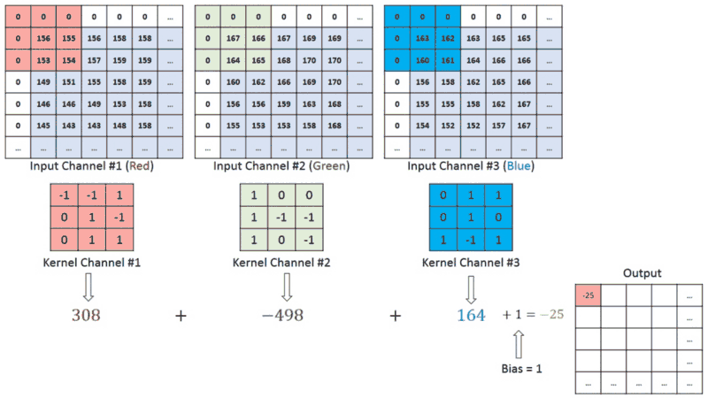

- `Pooling Layer`: Layer to reduce the dimensions of the image.


- `Fully Connected Layer`: Layer to connect the results from the previous layer to the output layer.


### Example of Image Feature Extraction with CNN

For details on image feature extraction results with CNN, you can see in [this notebook](./modelling/example_feature_extraction.ipynb).

### Parameters
CNN has several parameters, namely:
- filters: Number of filters (neurons) used in the Convolutional Layer.
- kernel_size: Size of the kernel used in the Convolutional Layer.
- strides: Number of "steps" taken by the filter in the Convolutional Layer.
- padding: Adding empty parts to the edges of the image.

FOR PARAMETER VISUALIZATION, YOU CAN SEE AT:
1. [Visualization 1](https://poloclub.github.io/cnn-explainer/)
2. [Visualization 2](https://ezyang.github.io/convolution-visualizer/index.html)

Here is the parameter documentation on [`tf.keras.layers.Conv2D`](https://www.tensorflow.org/api_docs/python/tf/keras/layers/Conv2D)

### Additional Layers in CNN
- `Batch Normalization`:
Normalization technique applied to each mini-batch to reduce "internal covariate shift" (changes in input distribution at each layer during the training process) that can slow down model convergence. The original Batch Normalization paper can be seen [here](https://arxiv.org/abs/1502.03167).
- `Dropout`:
Regularization method to prevent overfitting by dropping or deactivating some neurons in certain layers with a certain probability. The original Dropout paper can be seen [here](https://jmlr.org/papers/v15/srivastava14a.html).
- `Regularization`:
Other regularization methods used to prevent overfitting by adding a penalty to the loss function. There are several types of regularization, such as L1, L2, and Elastic Net. The original Regularization paper can be seen [here](https://robotics.stanford.edu/~ang/papers/icml04-l1l2.pdf).

## Deployment
After training the model, the next step is to determine the appropriate deployment method for our model use case so that it can be accessed (easily) by systems or other people. Note that the method to be used needs consideration because in the long term it will affect cost (most importantly :pensive:) and performance (scalability, latency).

### Deployment Options
When discussing deployment methods, some commonly used options (nowadays) are cloud-based, on-premise, edge, and serverless deployment:

| Method      | Description | Pros & Cons | Use Case |
|-------------|-------------|-------------|----------|
| Cloud-Based | Model is hosted and run on a server in a virtual network (cloud) usually maintained by third-party like Amazon Webservice, Google Cloud, or Microsoft Azure | <li>Scaling on demand (Scalable)</li> <li>Low latency</li> <li>Easy to implement</li> <li>Recurrent Fees even if the model is not/rarely used</li> <li>Vendor lock-in when using managed services (Sagemaker, Vertex AI, etc.)</li> | Mid-sized project, consistent model usage |
| On-Premise  | Model is hosted and run on own physical server | <li>Very flexible infrastructure</li> <li>No recurrent fees but must know upfront investment (long-term can be cheaper than cloud)</li> <li>Hard to implement</li> | Large-scale project with large investment, enterprise or corporate |
| Edge Deployment | Model is placed directly on edge devices (smartphone, IOT, etc.) | <li>Real-time prediction and low latency</li> <li>Straightforward implementation</li> <li>User data secure because it never leaves the device</li> <li>Not recommended for complex models that require more computing power</li> | Only recommended for simple and lightweight models |
| Serverless Function | Model is hosted in a container and will only run if there is a request | <li>Cost Effective, only pay for the time the model is run</li> <li>Save computing resources</li> <li>Minimal infrastructure management</li> <li>Execution time limit, function will "sleep" if inactive for a certain interval of time</li> <li>Cold Start, delay when the server restarts the function that was "sleeping" because it was inactive for a long time</li> | For development-stage of an application or application with few users |

### Example Walkthrough
We will deploy a muffin vs chihuahua classification model as a [Streamlit](https://docs.streamlit.io/) webapp using [Hugging Face](https://huggingface.co/).

1. On the hugging face website homepage, create a new space by clicking the profile icon and selecting the `+ New Space` option

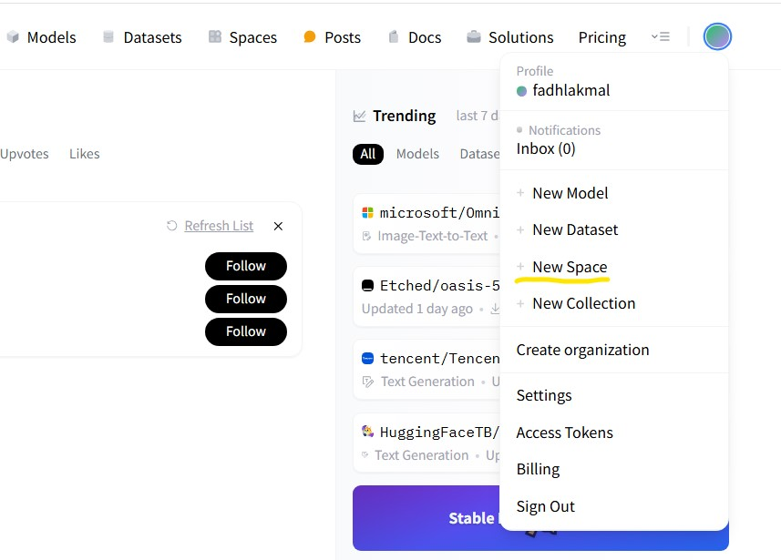

2. After proceeding to the `Create a new Space` view, specify the Space name and License, and select the Streamlit SDK

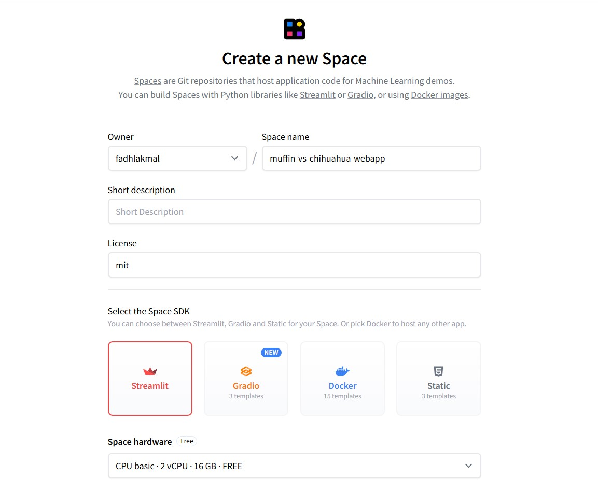

Once done, click the `Create Space` button.

3. Clone the repo to local

```
git clone https://huggingface.co/spaces/fadhlakmal/muffin-vs-chihuahua-webapp
cd muffin-vs-chihuahua-webapp
```

4. In the root directory, add `app.py` as the app entry point, `requirements.txt` to specify the dependencies used in the app, and our model

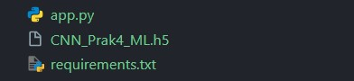

5. **Optional,** Setup virtual environment if you don't want to use the local environment

```
python -m venv venv
venv\Scripts\activate
```

6. Install the required packages, note these packages in `requirement.txt`

```
pip install streamlit tensorflow pillow
```

`requirement.txt`:
```
pillow==10.4.0
streamlit==1.39.0
tensorflow==2.18.0
```

7. Add the display using streamlit in `app.py`

Import packages and setup the web page
```py
# Import necessary libraries
import streamlit as st              # Streamlit for web app
import tensorflow as tf             # TensorFlow for the model
from tensorflow.keras.preprocessing.image import load_img, img_to_array  # Image processing
import numpy as np                  # Numerical operations
from PIL import Image              # Image handling
import io                          # Input/output operations

# Configure the Streamlit page
st.set_page_config(
        page_title="Chihuahua vs Muffin Classifier",  # Browser tab title
        layout="centered"                             # Center the content
)
```

Load the model into cache
```py
@st.cache_resource  # Cache the model to avoid reloading every time
def load_model():
        return tf.keras.models.load_model('CNN_Prak4_ML.h5')  # Load your saved model
```

Preprocess the image (make sure it matches your implementation)
```py
def preprocess_image(img):
        img = img.resize((128, 128))           # Resize to match model's expected input
        img = img_to_array(img)                # Convert PIL image to numpy array
        img = np.expand_dims(img, axis=0)      # Add batch dimension
        img = img / 255.0                      # Normalize pixel values to [0,1]
        return img
```

Add label mapping to convert prediction probabilities to the appropriate labels
```py
LABEL_CLASS = {
        0: "chihuahua",
        1: "muffin",
}
```

Define the main app function, streamlit provides several displays and widgets that we can use (read the [documentation](https://docs.streamlit.io/) for more details)
```py
def main():
        # Add title and description
        st.title("Chihuahua vs Muffin Classifier")
        st.write("Upload an image and the model will predict whether it's a chihuahua or a muffin!")
        
        # Create file uploader widget
        uploaded_file = st.file_uploader("Choose an image...", type=["jpg", "jpeg", "png"])
        
        if uploaded_file is not None:  # If an image was uploaded
                # Display the uploaded image
                image = Image.open(uploaded_file)
                st.image(image, caption='Uploaded Image', use_column_width=True)
                
                # Create predict button
                if st.button('Predict'):
                        # Load the model (cached)
                        model = load_model()
                        
                        # Preprocess the image
                        processed_image = preprocess_image(image)
                        
                        # Make prediction with loading spinner
                        with st.spinner('Predicting...'):
                                prediction = model.predict(processed_image)              # Get model prediction
                                pred_class = LABEL_CLASS[np.argmax(prediction)]         # Get predicted class
                                confidence = float(prediction.max()) * 100              # Calculate confidence
                        
                        # Show results
                        st.success(f'Prediction: {pred_class.upper()}')            # Show predicted class
                        st.info(f'Confidence: {confidence:.2f}%')                  # Show confidence
                        
                        # Show probability bars for each class
                        st.write("Class Probabilities:")
                        for i, prob in enumerate(prediction[0]):
                                st.progress(float(prob))                               # Show probability bar
                                st.write(f"{LABEL_CLASS[i]}: {float(prob)*100:.2f}%") # Show probability text
```

Add the python script entry point
```py
if __name__ == "__main__":
        main() # Run the main function when script is executed
```

**Full Code**
```py
import streamlit as st
import tensorflow as tf
from tensorflow.keras.preprocessing.image import load_img, img_to_array
import numpy as np
from PIL import Image
import io

st.set_page_config(
        page_title="Chihuahua vs Muffin Classifier",
        layout="centered"
)

@st.cache_resource
def load_model():
        return tf.keras.models.load_model('CNN_Prak4_ML.h5')

def preprocess_image(img):
        img = img.resize((128, 128))
        img = img_to_array(img)
        img = np.expand_dims(img, axis=0)
        img = img / 255.0
        return img

LABEL_CLASS = {
        0: "chihuahua",
        1: "muffin",
}

def main():
        st.title("Chihuahua vs Muffin Classifier")
        st.write("Upload an image and the model will predict whether it's a chihuahua or a muffin!")
        
        uploaded_file = st.file_uploader("Choose an image...", type=["jpg", "jpeg", "png"])
        
        if uploaded_file is not None:
                image = Image.open(uploaded_file)
                st.image(image, caption='Uploaded Image', use_column_width=True)
                
                if st.button('Predict'):
                        model = load_model()
                        
                        processed_image = preprocess_image(image)
                        
                        with st.spinner('Predicting...'):
                                prediction = model.predict(processed_image)
                                pred_class = LABEL_CLASS[np.argmax(prediction)]
                                confidence = float(prediction.max()) * 100
                        
                        st.success(f'Prediction: {pred_class.upper()}')
                        st.info(f'Confidence: {confidence:.2f}%')
                        
                        st.write("Class Probabilities:")
                        for i, prob in enumerate(prediction[0]):
                                st.progress(float(prob))
                                st.write(f"{LABEL_CLASS[i]}: {float(prob)*100:.2f}%")

if __name__ == "__main__":
        main()
```

8. Run the app, by default the app is available on localhost port 8501

```
streamlit run app.py
```

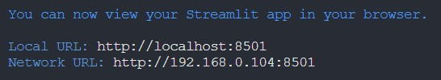

Initial display
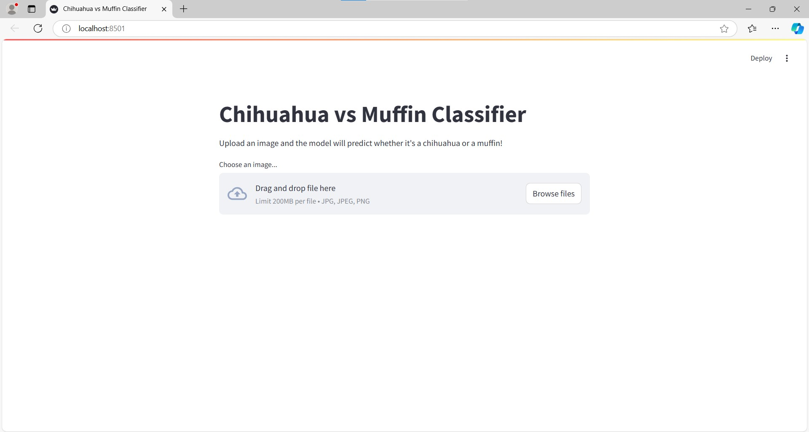

Input image `Browse files`
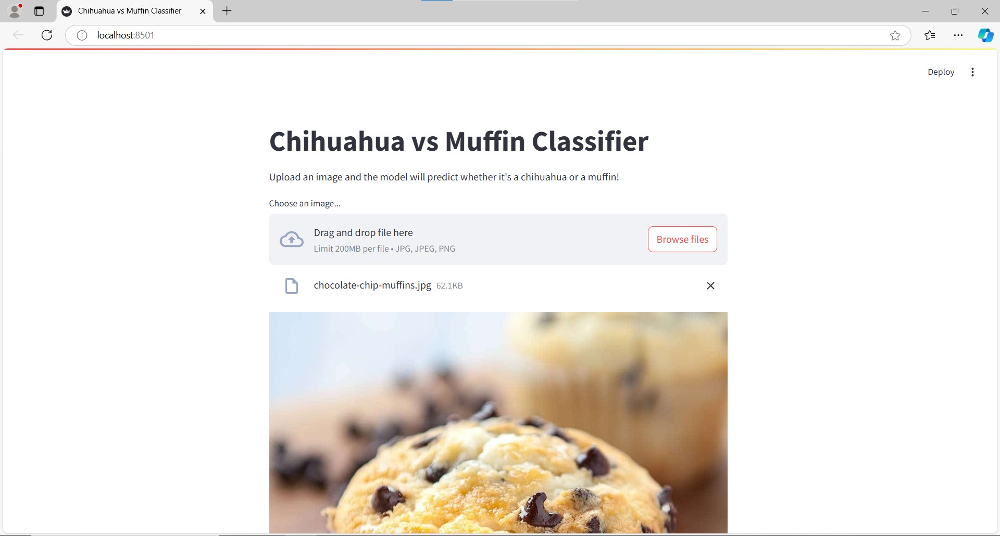

Waiting for prediction result `Predict`
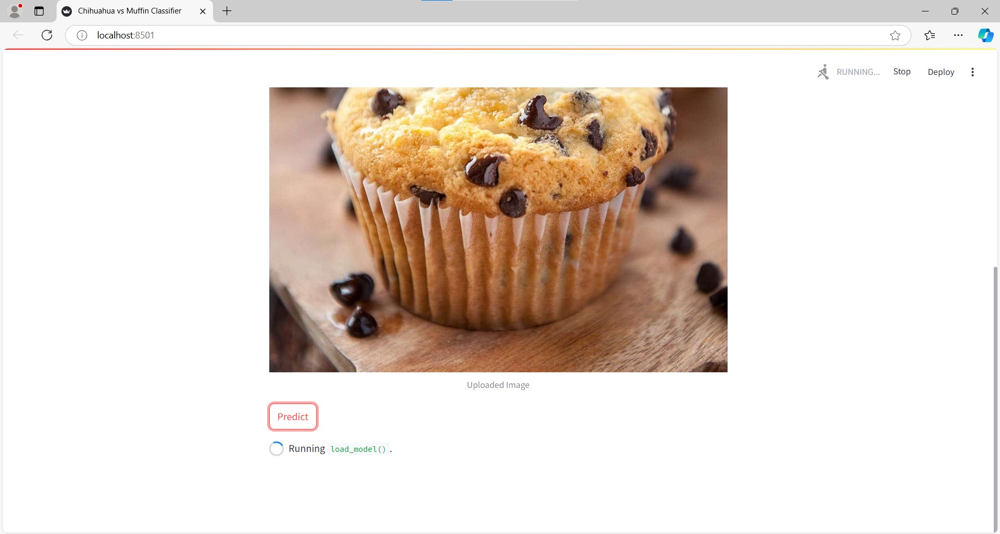

Prediction output
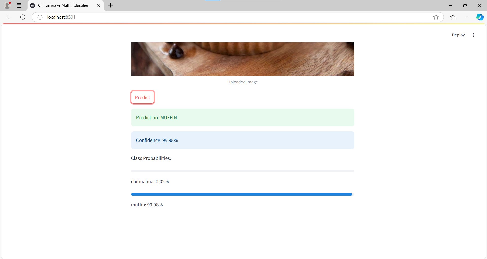

9. If satisfied with the display, commit and push changes (exclude venv) to the huggingface repository or manually add to `files` in the space

a. Adding changes via cli
```
git add .
git commit -m "Add files"
git push
```
b. Adding to `files` manually
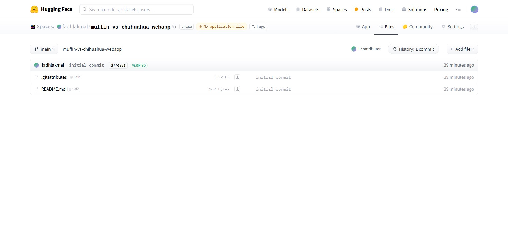

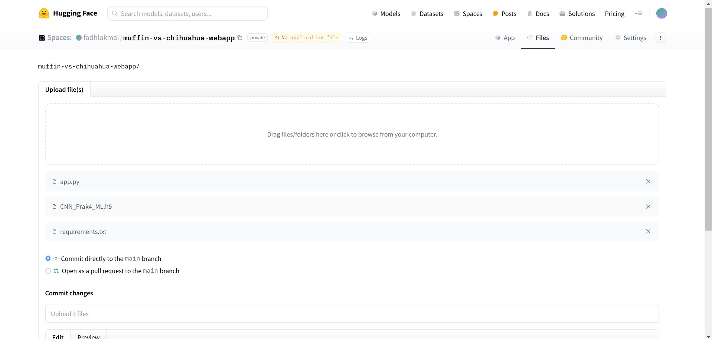

Then click `commit to main`

10. After the build is complete, the webapp can be accessed at `https://huggingface.co/spaces/{Username}/{Space Name}` (Example https://huggingface.co/spaces/fadhlakmal/muffin-vs-chihuahua-webapp)

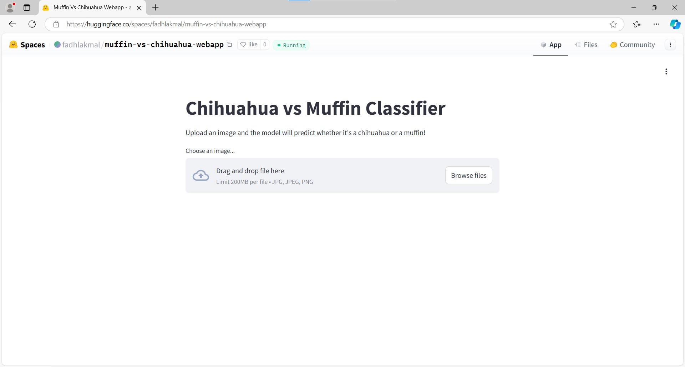
