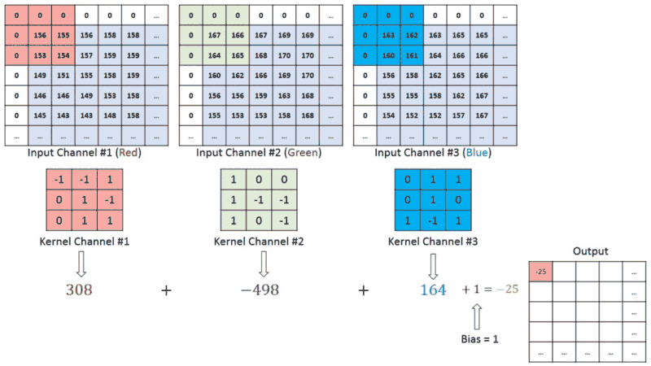

# Modul 4: CNN (Convolutional Neural Network)

## Daftar Isi
- [Pengenalan](#pengenalan)
- [Deskripsi](#deskripsi)
  - [CNN Layers](#cnn-layers)
  - [Contoh Hasil Ekstraksi Fitur Gambar dengan CNN](#contoh-hasil-ekstraksi-fitur-gambar-dengan-cnn)
  - [Parameter](#parameter)
  - [Tambahan Layer Pada CNN](#tambahan-layer-pada-cnn)

## Pengenalan
CNN (Convolutional Neural Network) adalah salah satu jenis arsitektur deep learning yang memiliki kemampuan untuk memproses data berupa gambar (walaupun sebenarnya bisa juga digunakan untuk hal lain seperti [Pemrosesan Bahasa Natural (NLP)](https://arxiv.org/abs/1809.02479/1000). Tapi kita tidak bahas hal itu disini). Ada 3 jenis konvolusi yang biasa digunakan pada CNN, yaitu:
- 1D Convolution: Biasa digunakan untuk data berupa time series / NLP.
- 2D Convolution: Biasa digunakan untuk data berupa gambar.
- 3D Convolution: Biasa digunakan untuk data berupa video atau data volumetrik (misalnya, data medis seperti MRI atau CT scan yang memiliki dimensi 3D).

## Deskripsi

### CNN Layers
CNN sendiri memiliki beberapa bagian layer, yakni:
- Convolutional Layer: Layer untuk identifikasi fitur sederhana dari gambar (tekstur, garis tepi, dsb).

- Pooling Layer: Layer untuk mengurangi dimensi dari gambar.

- Fully Connected Layer: Layer untuk menghubungkan hasil dari layer sebelumnya dengan output layer.

### Contoh Hasil Ektraksi Fitur Gambar dengan CNN

Untuk detail hasil ekstraksi fitur gambar dengan CNN, bisa dilihat pada [notebook ini](./example_feature_extraction.ipynb).

### Parameter
CNN memiliki beberapa parameter, yakni:
- filters: Jumlah filter (Neuron) yang digunakan pada Convolutional Layer.
- kernel_size: Ukuran kernel yang digunakan pada Convolutional Layer.
- strides: Banyaknya "langkah" yang dilakukan filter pada Convolutional Layer.
- padding: Menambahkan bagian kosong pada tepi gambar.

UNTUK VISUALISASI PARAMETER, BISA DILIHAT PADA:
1. [Visualisasi 1](https://poloclub.github.io/cnn-explainer/)
2. [Visualisasi 2](https://ezyang.github.io/convolution-visualizer/index.html)

Berikut ini adalah dokumentasi parameter pada [`tf.keras.layers.Conv2D`](https://www.tensorflow.org/api_docs/python/tf/keras/layers/Conv2D)

### Tambahan Layer Pada CNN
- `Batch Normalization`:
Teknik normalisasi yang diterapkan pada setiap mini-batch untuk mengurangi "internal covariate shift" (perubahan distribusi input pada setiap layer selama proses training) yang dapat memperlambat konvergensi model. Paper asli Batch Normalization dapat dilihat [disini](https://arxiv.org/abs/1502.03167).
- `Dropout`:
Metode regularisasi untuk mencegah overfitting dengan cara men-drop atau menonaktifkan sebagian neuron pada layer tertentu dengan probabilitas tertentu. Paper asli Dropout dapat dilihat [disini](https://jmlr.org/papers/v15/srivastava14a.html).
- `Regularization`:
Metode regularisasi lainnya yang digunakan untuk mencegah overfitting dengan cara menambahkan penalty pada loss function. Ada beberapa jenis regularisasi, seperti L1, L2, dan Elastic Net. Paper asli Regularization dapat dilihat [disini](https://robotics.stanford.edu/~ang/papers/icml04-l1l2.pdf).