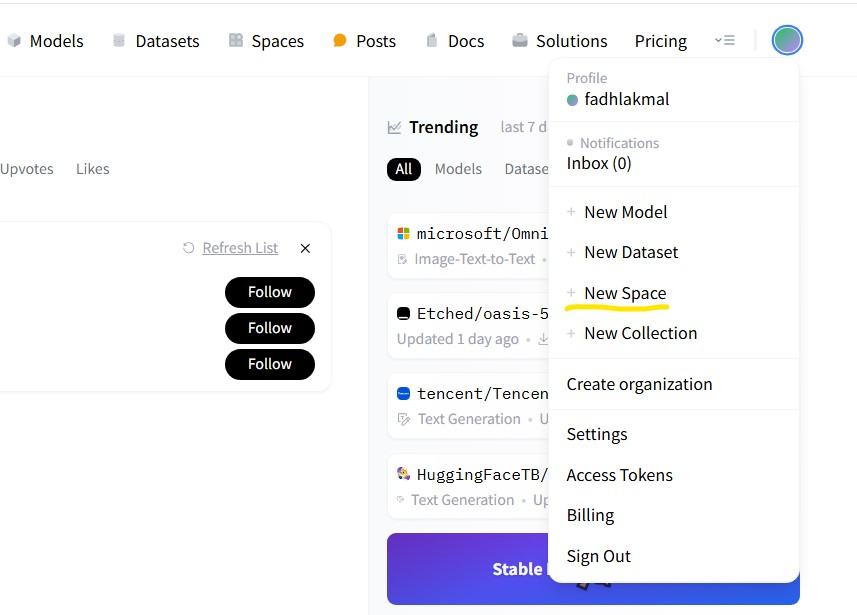
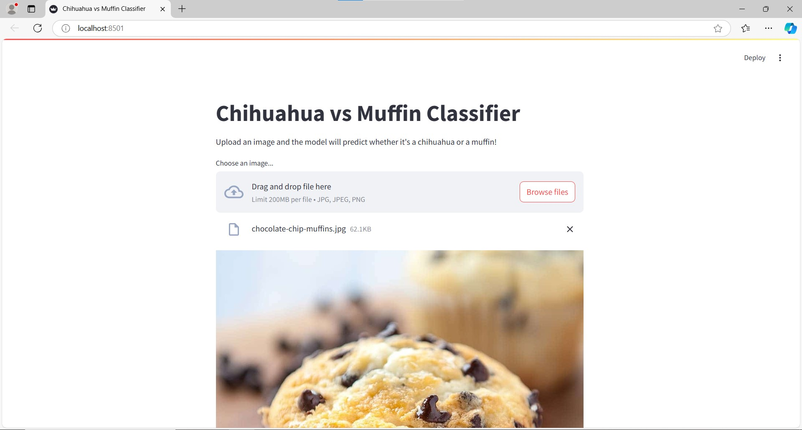
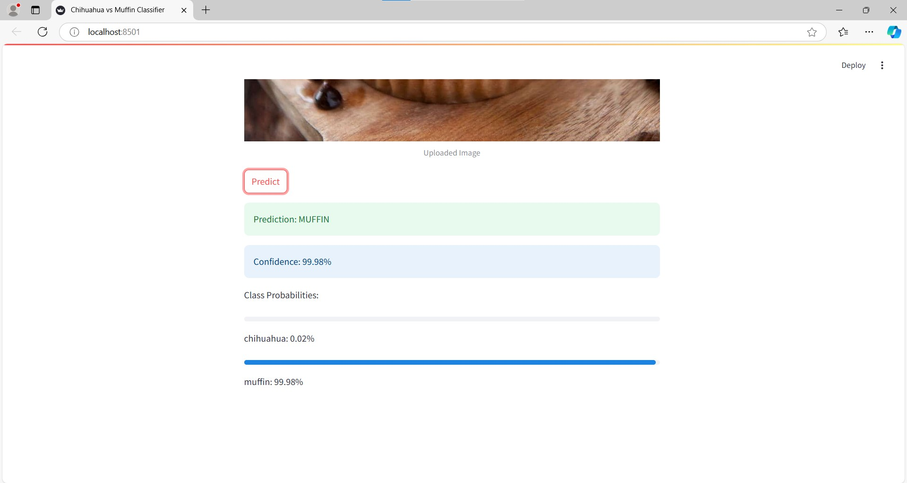
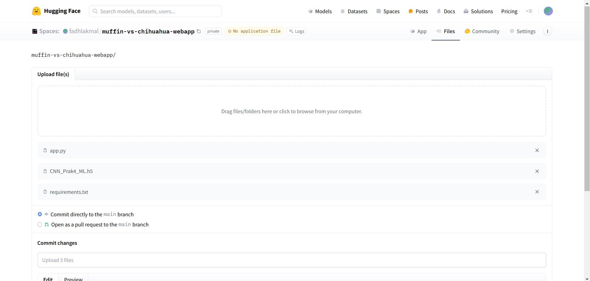

# Modul 4: CNN & Deployment

## Daftar Isi
- [Modul 4: CNN & Deployment](#modul-4-cnn-&-deployment)
  - [Daftar Isi](#daftar-isi)
  - [Pengenalan](#pengenalan)
  - [Deskripsi](#deskripsi)
    - [CNN Layers](#cnn-layers)
    - [Contoh Hasil Ektraksi Fitur Gambar dengan CNN](#contoh-hasil-ektraksi-fitur-gambar-dengan-cnn)
    - [Parameter](#parameter)
    - [Tambahan Layer Pada CNN](#tambahan-layer-pada-cnn)
  - [Deployment](#deployment)
    - [Deployment Options](#deployment-options)
    - [Example Walkthrough](#example-walkthrough)

## Pengenalan
CNN (Convolutional Neural Network) adalah salah satu jenis arsitektur deep learning yang memiliki kemampuan untuk memproses data berupa gambar (walaupun sebenarnya bisa juga digunakan untuk hal lain seperti [Pemrosesan Bahasa Natural (NLP)](https://arxiv.org/abs/1809.02479/1000). Tapi kita tidak bahas hal itu disini). Ada 3 jenis konvolusi yang biasa digunakan pada CNN, yaitu:
- 1D Convolution: Biasa digunakan untuk data berupa time series / NLP.
- 2D Convolution: Biasa digunakan untuk data berupa gambar.
- 3D Convolution: Biasa digunakan untuk data berupa video atau data volumetrik (misalnya, data medis seperti MRI atau CT scan yang memiliki dimensi 3D).

## Deskripsi

### CNN Layers
CNN sendiri memiliki beberapa bagian layer, yakni:
- `Convolutional Layer`: Layer untuk identifikasi fitur sederhana dari gambar (tekstur, garis tepi, dsb).


- `Pooling Layer`: Layer untuk mengurangi dimensi dari gambar.


- `Fully Connected Layer`: Layer untuk menghubungkan hasil dari layer sebelumnya dengan output layer.


### Contoh Hasil Ektraksi Fitur Gambar dengan CNN

Untuk detail hasil ekstraksi fitur gambar dengan CNN, bisa dilihat pada [notebook ini](./modelling/example_feature_extraction.ipynb).

### Parameter
CNN memiliki beberapa parameter, yakni:
- filters: Jumlah filter (Neuron) yang digunakan pada Convolutional Layer.
- kernel_size: Ukuran kernel yang digunakan pada Convolutional Layer.
- strides: Banyaknya "langkah" yang dilakukan filter pada Convolutional Layer.
- padding: Menambahkan bagian kosong pada tepi gambar.

UNTUK VISUALISASI PARAMETER, BISA DILIHAT PADA:
1. [Visualisasi 1](https://poloclub.github.io/cnn-explainer/)
2. [Visualisasi 2](https://ezyang.github.io/convolution-visualizer/index.html)

Berikut ini adalah dokumentasi parameter pada [`tf.keras.layers.Conv2D`](https://www.tensorflow.org/api_docs/python/tf/keras/layers/Conv2D)

### Tambahan Layer Pada CNN
- `Batch Normalization`:
Teknik normalisasi yang diterapkan pada setiap mini-batch untuk mengurangi "internal covariate shift" (perubahan distribusi input pada setiap layer selama proses training) yang dapat memperlambat konvergensi model. Paper asli Batch Normalization dapat dilihat [disini](https://arxiv.org/abs/1502.03167).
- `Dropout`:
Metode regularisasi untuk mencegah overfitting dengan cara men-drop atau menonaktifkan sebagian neuron pada layer tertentu dengan probabilitas tertentu. Paper asli Dropout dapat dilihat [disini](https://jmlr.org/papers/v15/srivastava14a.html).
- `Regularization`:
Metode regularisasi lainnya yang digunakan untuk mencegah overfitting dengan cara menambahkan penalty pada loss function. Ada beberapa jenis regularisasi, seperti L1, L2, dan Elastic Net. Paper asli Regularization dapat dilihat [disini](https://robotics.stanford.edu/~ang/papers/icml04-l1l2.pdf).

## Deployment
Setelah melatih model, langkah selanjutnya adalah menentukan metode deployment yang sesuai dengan use case model kita agar dapat diakses (dengan mudah) oleh sistem atau orang lain. Note bahwa metode yang akan digunakan perlu pertimbangan karena dalam jangka waktu yang panjang akan berpengaruh dalam cost (paling penting ini :pensive:) dan performance (scalability, latency).

### Deployment Options
Saat membahas metode deployment, beberapa opsi yang umum digunakan (sekarang) adalah cloud-based, on-premise, edge, dan serverless deployment:

| Metode      | Keterangan | Kelebihan & Kekurangan | Use Case |
|-------------|------------|------------------------|----------|
| Cloud-Based | Model dihosting dan dijalankan pada server dalam virtual network (cloud) biasanya yang dimaintain oleh third-party seperti Amazon Webservice, Google Cloud, atau Microsoft Azure | <li>Scaling on demand (Scalable)</li> <li>Low latency</li> <li>Mudah untuk diimplementasi</li> <li>Recurrent Fees meskipun model tidak/jarang digunakan</li> <li>Vendor lock-in saat menggunakan managed service (Sagemaker, Vertex AI, etc.)</li> | Mid-sized project, consistent model usage |
| On-Premise  | Model dihosting dan dijalankan pada physical server sendiri | <li>Infrastruktur sangat flexible</li> <li>Tidak ada recurrent fees tetapi harus mengetahui upfront investment (long-term bisa jadi lebih murah dibandingkan cloud)</li> <li>Sulit untuk diimplementasi</li> | Large-scale project dengan investasi besar, enterprise atau korporat |
| Edge Deployment | Model diletakkan langsung pada edge device (smartphone, IOT, etc.) | <li>Prediksi real-time dan low latency</li> <li>Implementasi straightforward</li> <li>User data secure karena tidak pernah keluar dari device</li> <li>Kurang disarankan untuk model kompleks yang membutuhkan kekuatan komputasi lebih</li> | Hanya disarankan untuk model simple dan lightweight |
| Serverless Function | Model dihosting pada container dan hanya akan dijalankan jika terdapat request | <li>Cost Effective, hanya membayar sesuai lamanya model dijalankan</li> <li>Hemat resource komputasi</li> <li>Minim manajemen infrastruktur</li> <li>Execution time limit, function akan di "sleep" jika inactive dalam suatu interval waktu tertentu</li> <li>Cold Start, delay saat server menyalakan kembali function yang di"sleep" sebab inactive lama</li> | Untuk development-stage suatu aplikasi atau aplikasi dengan jumlah user sedikit |

### Example Walkthrough
Kita akan men-deploy model klasifikasi muffin vs chihuahua sebagai [Streamlit](https://docs.streamlit.io/) webapp menggunakan [Hugging Face](https://huggingface.co/).

1. Pada homepage website hugging face, buatlah space baru dengan cara klik icon profile dan pilih opsi `+ New Space`



2. Setelah dilanjutkan ke tampilan `Create a new Space`, tentukan Space name dan License, dan pilih SDK Streamlit


Jika sudah, klik tombol `Create Space`.

3. Clone repo ke local

```
git clone https://huggingface.co/spaces/fadhlakmal/muffin-vs-chihuahua-webapp
cd muffin-vs-chihuahua-webapp
```

4. Pada root directory, tambahkan `app.py` sebagai entry point app,  `requirements.txt` untuk menentukan dependency yang digunakan pada app, serta model kita


5. **Opsional,** Setup virtual environtment jika tidak ingin menggunakan local environtment

```
python -m venv venv
venv\Scripts\activate
```

6. Install package yang dibutuhkan, catat package tersebut pada `requirement.txt`

```
pip install streamlit tensorflow pillow
```

`requirement.txt`:
```
pillow==10.4.0
streamlit==1.39.0
tensorflow==2.18.0
```

7. Tambahkan tampilan menggunakan streamlit pada `app.py`

Import package dan setup halaman web
```py
# Import necessary libraries
import streamlit as st              # Streamlit for web app
import tensorflow as tf             # TensorFlow for the model
from tensorflow.keras.preprocessing.image import load_img, img_to_array  # Image processing
import numpy as np                  # Numerical operations
from PIL import Image              # Image handling
import io                          # Input/output operations

# Configure the Streamlit page
st.set_page_config(
    page_title="Chihuahua vs Muffin Classifier",  # Browser tab title
    layout="centered"                             # Center the content
)
```

Load model ke cache
```py
@st.cache_resource  # Cache the model to avoid reloading every time
def load_model():
    return tf.keras.models.load_model('CNN_Prak4_ML.h5')  # Load your saved model
```

Preprocess gambar (pastikan sesuai dengan implementasi masing-masing)
```py
def preprocess_image(img):
    img = img.resize((128, 128))           # Resize to match model's expected input
    img = img_to_array(img)                # Convert PIL image to numpy array
    img = np.expand_dims(img, axis=0)      # Add batch dimension
    img = img / 255.0                      # Normalize pixel values to [0,1]
    return img
```

Tambahkan label mapping untuk merubah probabilitas prediksi ke label yang sesuai
```py
LABEL_CLASS = {
    0: "chihuahua",
    1: "muffin",
}
```

Definisikan fungsi main app, streamlit menyediakan beberapa tampilan dan widget sehingga tinggal kita gunakan (selengkapnya baca [dokumentasi](https://docs.streamlit.io/))
```py
def main():
    # Add title and description
    st.title("Chihuahua vs Muffin Classifier")
    st.write("Upload an image and the model will predict whether it's a chihuahua or a muffin!")
    
    # Create file uploader widget
    uploaded_file = st.file_uploader("Choose an image...", type=["jpg", "jpeg", "png"])
    
    if uploaded_file is not None:  # If an image was uploaded
        # Display the uploaded image
        image = Image.open(uploaded_file)
        st.image(image, caption='Uploaded Image', use_column_width=True)
        
        # Create predict button
        if st.button('Predict'):
            # Load the model (cached)
            model = load_model()
            
            # Preprocess the image
            processed_image = preprocess_image(image)
            
            # Make prediction with loading spinner
            with st.spinner('Predicting...'):
                prediction = model.predict(processed_image)              # Get model prediction
                pred_class = LABEL_CLASS[np.argmax(prediction)]         # Get predicted class
                confidence = float(prediction.max()) * 100              # Calculate confidence
            
            # Show results
            st.success(f'Prediction: {pred_class.upper()}')            # Show predicted class
            st.info(f'Confidence: {confidence:.2f}%')                  # Show confidence
            
            # Show probability bars for each class
            st.write("Class Probabilities:")
            for i, prob in enumerate(prediction[0]):
                st.progress(float(prob))                               # Show probability bar
                st.write(f"{LABEL_CLASS[i]}: {float(prob)*100:.2f}%") # Show probability text
```

Tambahkan entry point script python
```py
if __name__ == "__main__":
    main() # Run the main function when script is executed
```

**Full Code**
```py
import streamlit as st
import tensorflow as tf
from tensorflow.keras.preprocessing.image import load_img, img_to_array
import numpy as np
from PIL import Image
import io

st.set_page_config(
    page_title="Chihuahua vs Muffin Classifier",
    layout="centered"
)

@st.cache_resource
def load_model():
    return tf.keras.models.load_model('CNN_Prak4_ML.h5')

def preprocess_image(img):
    img = img.resize((128, 128))
    img = img_to_array(img)
    img = np.expand_dims(img, axis=0)
    img = img / 255.0
    return img

LABEL_CLASS = {
    0: "chihuahua",
    1: "muffin",
}

def main():
    st.title("Chihuahua vs Muffin Classifier")
    st.write("Upload an image and the model will predict whether it's a chihuahua or a muffin!")
    
    uploaded_file = st.file_uploader("Choose an image...", type=["jpg", "jpeg", "png"])
    
    if uploaded_file is not None:
        image = Image.open(uploaded_file)
        st.image(image, caption='Uploaded Image', use_column_width=True)
        
        if st.button('Predict'):
            model = load_model()
            
            processed_image = preprocess_image(image)
            
            with st.spinner('Predicting...'):
                prediction = model.predict(processed_image)
                pred_class = LABEL_CLASS[np.argmax(prediction)]
                confidence = float(prediction.max()) * 100
            
            st.success(f'Prediction: {pred_class.upper()}')
            st.info(f'Confidence: {confidence:.2f}%')
            
            st.write("Class Probabilities:")
            for i, prob in enumerate(prediction[0]):
                st.progress(float(prob))
                st.write(f"{LABEL_CLASS[i]}: {float(prob)*100:.2f}%")

if __name__ == "__main__":
    main()
```

8. Jalankan app, by default app tersedia pada localhost port 8501

```
streamlit run app.py
```


Tampilan awal


Input gambar `Browse files`


Menunggu hasil prediksi `Predict`


Output prediksi


9. Jika sudah puas dengan tampilan, commit dan push perubahan (exclude venv) ke repository huggingface atau secara manual tambahkan pada `files` di space

a. Menambahkan perubahan via cli
```
git add .
git commit -m "Add files"
git push
```
b. Menambahkan ke `files` secara manual




Kemudian klik `commit to main`

10. Setelah build selesai, webapp dapat diakses pada `https://huggingface.co/spaces/{Username}/{Nama Space}` (Contoh https://huggingface.co/spaces/fadhlakmal/muffin-vs-chihuahua-webapp)


